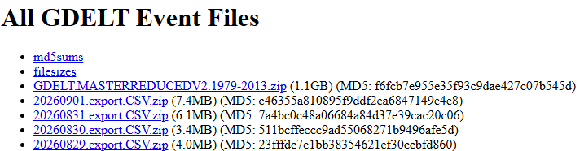

```{r setup, include=FALSE}
# fig.pos = "H" pins every figure exactly where its chunk sits instead of letting
# LaTeX float it to wherever it next finds room - the figure equivalent of the
# HOLD_position used on the kable() tables below. It needs \usepackage{float},
# which is already loaded in the YAML header above.
# out.extra = "" clears the default pdf_document setting, which would otherwise
# override fig.pos and let the figures drift again.
# autodep = TRUE makes knitr work out which cached chunks depend on which other
# cached chunks by tracking the objects they use. Without it, changing an early
# chunk (say, adding a column to the modelling data) leaves every later cached
# chunk replaying its old output against data that no longer exists.
knitr::opts_chunk$set(echo = TRUE, warning = FALSE, message = FALSE,
                      fig.pos = "H", out.extra = "", autodep = TRUE)
```
\newpage

# Introduction
This is my final project of the Data Science: Capstone, HarvardX PH125.9x. A course in Machine Learning based on the R programming language. In this project, I look at the GDELT Event Database (Global Database of Events, Language, and Tone) to ask a fairly simple question: what makes a geopolitical event attract more media attention?

Every event GDELT records already carries a "theoretical" impact score, the Goldstein scale, assigned by the type of event itself (a protest and a bombing get different scores, regardless of how big either one actually was). What GDELT also records, separately, is how much the world's media actually wrote about that specific event (`NumArticles`, `NumMentions`, `NumSources`) and in what tone (`AvgTone`). This project tries to model actual media coverage volume from an event's characteristics - type, actors involved, and geography - using linear regression.

I have no background in political science, journalism, or media studies. I'm approaching this purely as a data/systems problem: an event happens (input), the world's media reacts (output), and the question is whether that reaction is at all predictable from the event's own attributes. My background is Engineering, and I am an Army Veteran. I have no interest in politics, any -isms and digging into why, any bias may be injected into the media coverage. 

During selecting this data for the basis of the this project, I went through quite a few data sources. I set up the following requirements for the data:

## Topic selection criteria
* Large data sets (>1M - yes, in real life systems, this is a tiny limit)
  + At my work, I have access to a LOT of data
* Publicly available data or data permitted to be published
  + This removes all my work data and all Government Databases requiring a login
* Data sets should not have been analyzed by thousands of others
  + This removes a lot of data sources.
* Running the code should be possible for anyone having R/RStudio installed
  + This leaves out the data processing of my Cluster in my home office
  
Originally, I wanted to create a model for monitoring an Enterprise Server Cluster automatically preventing Cluster Failure thus stopping 600+ developers from being able to work. This would be done using a "Rolling Window" strategy and looking for events inside this "Window" fitting the pattern observed prior to Cluster Failure. However, this data (even in anonymized form) was not to be published or if so, Legal had to give consent, and that would take weeks to months. I then came up with the idea of looking into a fringe theory regarding Solar Activity and Earthquakes (if you search the git history in the repo, you would be able to look into this project). This, however, turned out to be a Red Herring - I could disprove the original theory put forth about 9 years ago. However, building a usable model for the the earthquakes based on this required more data and a deeper dig than time permits. It already took about 2 hrs to download all data, so this would be moved to the list of hobby projects. 

\newpage

# Method
In attacking the problem of looking into how media is covering various type of events, we first need a plan. This is adjusted as time goes in order to continously improving the model. 

## Plan of attack
Starting out any project (even hobby ones), I start out by having a plan of attack:

* Setup the environment
  + Install necessary libraries (if missing)
  + Include necessary libraries
* Prepare the data set for initial analysis
  + Download data set (if missing) and unpack
  + Split the data set into training set / test set
* Analyze the data set
  + Look into data structures
  + Visualize data to understand distributions and patterns
  + Identify any patterns
* Model Development
  + Step 1: Establish the response variable (media coverage volume) and its distribution
  + Step 2: Fit a linear regression against event/actor/geography features
  + Step 3: Check model assumptions and compare against a naive baseline
* Model Testing and Verification
* Model Analysis
* Further questions to be investigated
* Conclusion

## Tools being used
Following tools were used in writing the report. 

```{r, tools, layout="l-body-outset", echo=FALSE}
# Initially load the libraries for this table
library(knitr)
library(kableExtra)

# Create the table data
tools_tab <- matrix(
  c("Operating System", "Windows 11 Home, 25H2", "Main Operating System",
    "Notepad++", "Notepad++ 8.9.1", "Scratch Pad while editing R/Rmd code",
    "PowerShell", "PowerShell 7.6.3", "Various scripting",
    "RStudio", "RStudio 2026.07.1+147 Pacific Dogwood for Windows", "Main IDE for Developing and running the code",
    "Claude", "Claude for Windows, Version 1.24012.9", "Assistant for validating syntax and web search"),
  ncol = 3, byrow = TRUE)
# Set the column names
colnames(tools_tab) <- c("Tool", "Version", "Usage")
# Display the table
kable(tools_tab, row.names = FALSE, format = "latex", booktabs = TRUE, linesep = "\\hline") %>%
  column_spec(2, width = "6cm") %>%
  column_spec(3, width = "7cm") %>%
  # Add styling
  kable_styling(latex_options = "HOLD_position", font_size = 6)
```

## Data source
A single data source is used in this project: 

```{r, data sources, layout="l-body-outset", echo=FALSE}
# Create the data table
data_urls_tab <- matrix(
c("GDELT Event Database", "http://data.gdeltproject.org/events/"),  ncol = 2, byrow = TRUE
)
# Set the column names
colnames(data_urls_tab) <- c("Source", "Url")
# Show the table
kable(data_urls_tab, row.names = FALSE) %>%
  # Add styling
  kable_styling(latex_options = "HOLD_position", font_size = 6)
```

## Disclaimer!!!!!!
I'm not a political scientist, journalist, or media studies researcher!!! This project only looks at whether media coverage *volume* is statistically associated with an event's recorded characteristics. It does not attempt to explain *why* journalists choose to cover some events more than others, does not make any claim about media bias, and does not attempt to judge the accuracy or fairness of coverage. If no meaningful pattern is found, that is itself a valid conclusion and will not be dismissed or re-framed to force a result.

\newpage
## Short GDELT Introduction
Just to have a basic understanding of the data itself, let me briefly touch upon what GDELT is and the small vocabulary of terms used throughout this project. GDELT records information about media coverage of events around the world:

### The CAMEO event taxonomy
GDELT codes every event it detects in the news using CAMEO (Conflict and Mediation Event Observations), a taxonomy originally developed for political event analysis. Every event is reduced to "Actor1 does `EventCode` to Actor2" - for example, "Government threatens Rebels" or "Country A appeals to Country B". Every `EventCode` rolls up into one of four `QuadClass` categories: Verbal Cooperation, Material Cooperation, Verbal Conflict, and Material Conflict. More can be read about CAMEO at [the CAMEO manual](http://gdeltproject.org/data/documentation/CAMEO.Manual.1.1b3.pdf) - http://gdeltproject.org/data/documentation/CAMEO.Manual.1.1b3.pdf

To illustrate the 4 classes, I'll show this in the following table:

```{r, quadclass-diagram, echo=FALSE, fig.width=6, fig.height=4.2, fig.align='center', fig.cap="The four GDELT QuadClass categories, formed by crossing verbal vs. material action with cooperative vs. conflictual intent."}
# Load library for showing the plot
library(ggplot2)

# First, create the data for the figure
  # Coordinates of the blocks
  # Labels for the blocks
  # Colors
quad_df <- data.frame(
  xmin  = c(0, 1, 0, 1),
  xmax  = c(1, 2, 1, 2),
  ymin  = c(1, 1, 0, 0),
  ymax  = c(2, 2, 1, 1),
  label = c("Verbal\nCooperation\n(QuadClass 1)",
            "Verbal\nConflict\n(QuadClass 3)",
            "Material\nCooperation\n(QuadClass 2)",
            "Material\nConflict\n(QuadClass 4)"),
  fill  = c("#56B4E9", "#E69F00", "#0072B2", "#D55E00")
)

# Render the figure itself
ggplot(quad_df) +
  # Render the rectangles
  geom_rect(aes(xmin = xmin, xmax = xmax, ymin = ymin, ymax = ymax, fill = fill),
            color = "white", linewidth = 1.2) +
  # Add labels
  geom_text(aes(x = (xmin + xmax) / 2, y = (ymin + ymax) / 2, label = label),
            color = "white", fontface = "bold", size = 4, lineheight = 0.9) +
  # Use values without scaling
  scale_fill_identity() +
  # Add annotations
  annotate("text", x = 1, y = 2.15,
           label = "<- Cooperation            Conflict ->",
           size = 3.6, fontface = "italic") +
  annotate("text", x = -0.2, y = 1,
           label = "Material                Verbal",
           angle = 90, size = 3.6, fontface = "italic") +
  # Zoom in
  coord_cartesian(xlim = c(-0.45, 2), ylim = c(0, 2.3), clip = "off") +
  # Blank themes as default
  theme_void() +
  # Set margins of the figure
  theme(plot.margin = margin(10, 10, 10, 25))
```

### Goldstein scale vs. media tone
Every `EventCode` also carries a fixed "Goldstein score" from -10 to +10, a theoretical estimate of how much that *type* of event affects the stability of a country - assigned once per event type, not per individual event. This is different from `AvgTone`, which is measured separately for every individual event from the actual sentiment of the news articles covering it, on a scale of roughly -10 (extremely negative) to +10 (extremely positive). One is a fixed label; the other is an empirical measurement. More can be read at [the GDELT data format codebook](http://data.gdeltproject.org/documentation/GDELT-Data_Format_Codebook.pdf) - http://data.gdeltproject.org/documentation/GDELT-Data_Format_Codebook.pdf. Be aware, that any survey is not fully covering the entire population of said area. 

\newpage

## Environment setup
### Loading libraries
To analyse the data and perform all the analysis, I intend to perform on the data itself, some packages need to be installed:

```{r libraries, results='hide'}
# Create a list of required packages
# car         - supporting further analysis and for testing the model
# countrycode - mapping ISO3/FIPS country codes to readable country names
# dplyr       - working with data frames in memory
# ggplot2     - handling plots
# here        - assisting location file system
# kableExtra  - additional styling
# lubridate   - handling times and dates
# MASS        - negative binomial regression (called as MASS::glm.nb, since attaching
#               MASS would mask dplyr::select)
# purrr       - handling functional programming
# readr       - reading csv files
# rpart       - regression tree for the third model
# scales      - percent/comma axis labels on the plots
# tidyr       - generally working with structured data
# tinytex     - supporting the formatting of the resulting report

required_packages <- c("here", "readr", "dplyr", "tidyr", "lubridate", "purrr",
                       "ggplot2", "car", "tinytex", "countrycode", "kableExtra",
                       "scales", "rpart", "MASS")

# Set default URLs to point to CRAN Mirror (to simplify installing packages)
if (length(getOption("repos")) == 0 || getOption("repos")["CRAN"] == "@CRAN@")
  options(repos = c(CRAN = "https://cloud.r-project.org"))

# Discover missing packages
missing_packages <- required_packages[!required_packages %in% installed.packages()[, "Package"]]

# Install any missing packages
if (length(missing_packages))
  install.packages(missing_packages)

# Load libraries hiding the output from the results
invisible(lapply(required_packages, library, character.only = TRUE))

```

## Data retrieval
GDELT publishes one file per day, so unlike a single bulk download, retrieval here means looping over a date range. In this assignment, I'll stick to only using a single month of data in order to limit the load on the PC running the code for review. In case of a larger survey, I'd look into larger date spans, but this would also use up more CPU, more Memory, Disk Space and time. 

```{r fig-fileoverview, echo=FALSE, out.width="50%", fig.align="center", fig.cap="File structure at GDELT"}
# Add graphics

```


```{r, data retrieval, layout="l-body-outset", echo=FALSE}
# Create a Matrix for generating the URLs for downloading the code
data_urls_and_methods_tab <- matrix(
c("GDELT Event Database", "http://data.gdeltproject.org/events/", "Download + Unzip (per day)"),  ncol = 3, byrow = TRUE
)
# Assign column names
colnames(data_urls_and_methods_tab) <- c("Source", "Url", "Method")
# Show overview
kable(data_urls_and_methods_tab, row.names = FALSE)
```


```{r, file download function, layout="l-body-outset"}

# Force the data folder to be in location relative to this file by setting the
# work directory to current location
dir_current_location <- here::here()

# Create function for downloading file from url into destination
# Only download file if this is missing from the destination
download_file <- function(url, destination_file) {

  # download.file() does not create missing directories itself - it just
  # errors out, so the destination folder (e.g. "data/" next to this .Rmd)
  # must be created first, before checking whether the file already exists.
  dir.create(dirname(destination_file), recursive = TRUE, showWarnings = FALSE)

  # Download file if missing
  if (!file.exists(destination_file))
    download.file(url, destination_file, mode = "wb")
}
```

Each daily file is served as a `.zip` (despite carrying a `.CSV` name inside), so on top of `download_file()` we need one extra step: unzip each file once it has been downloaded, and skip files that are missing on the server entirely (some very old dates near the start of the archive have gaps). A "cleaner" solution would be to remove the zip files themselves (and maybe even the data folder) after having generated the PDF report. However, I'll leave the data in place for the manual inspection of them. 

```{r, gdelt download function, layout="l-body-outset"}

# Create a function which downloads and unpacks one day's GDELT export file, 
# skipping anything already on disk and tolerating days missing from the server
# (early archive gaps).
download_gdelt_day <- function(day, destination_folder = "data/gdelt") {
  # Generate the string representation of the day
  day_str <- format(day, "%Y%m%d")
  # Generate the full url based on the day string
  url <- sprintf("http://data.gdeltproject.org/events/%s.export.CSV.zip", day_str)

  # Generate the full paths for the zip and csv files
  zip_file <- file.path(destination_folder, paste0(day_str, ".export.CSV.zip"))
  csv_file <- file.path(destination_folder, paste0(day_str, ".export.CSV"))

  # Skip if the csv file already has been extracted from a downloaded zip file
  if (file.exists(csv_file)) return(invisible(NULL))

  # Download and unzip the file catching any error.
  tryCatch({
    download_file(url, zip_file)
    unzip(zip_file, exdir = destination_folder)
  }, error = function(e) NULL)
}

# Downloads every day in [start_date, end_date] into destination_folder
download_gdelt_events <- function(start_date, end_date, destination_folder = "data/gdelt") {
  days <- seq(as.Date(start_date), as.Date(end_date), by = "day")
  for (day in days) {
    download_gdelt_day(as.Date(day, origin = "1970-01-01"), destination_folder)
  }
}
```

Downloading the full GDELT history (back to 1979) would run into hundreds of GB, which is out of scope for this project. This would take too long for local analysis. Hence, I'll scope the analysis to a single recent month instead, which is already well over the 500,000-row minimum on its own. Having run larger downloads for my original project (which took hours), I'll add a lock file so re-knitting the document doesn't re-download everything: delete `gdelt.lock` in the data folder to fetch again (a single month is on the order of a few hundred MB - unzipped about 1 GB).

```{r, gdelt downloads, layout="l-body-outset"}

# Scope: one complete month (August) to begin with. This can be Widened if
# time and interest permits it
gdelt_start_date <- "2026-08-01"
gdelt_end_date   <- "2026-08-31"

# "Lock file" preventing further download
lock_file <- "data/gdelt.lock"

# Check for presence of lock file.
# If present, don't download data.
# If not present, download data
if (!file.exists(lock_file)) {
  download_gdelt_events(gdelt_start_date, gdelt_end_date)

  # Create file to prevent download
  # Remember to delete this date range is changed/expanded.
  cat("Done", file = lock_file)
}
```

# Data Analysis
Having downloaded a month of daily export files, let's start looking into the raw data.

## Parsing the data sources
Before, we can use the data for anything, it needs to be imported into our internal structures. 

### `[YYYYMMDD].export.CSV`
GDELT event files have **no header row**, and despite the `.CSV` extension are **tab-delimited**. The full column layout (58 fields for files from April 2013 onward, confirmed against GDELT's own [Data Format Codebook](https://gdeltproject.org/data/documentation/GDELT-Data_Format_Codebook.pdf)) is:

```{r, field-layout, echo=FALSE}
library(knitr)
library(kableExtra)

# Create data set
field_layout <- data.frame(
  # List fields (columns in .csv file)
  Field = c(
    "GlobalEventID", "Day", "MonthYear", "Year", "FractionDate",
    "Actor1Code", "Actor1Name", "Actor1CountryCode", "Actor1KnownGroupCode", "Actor1EthnicCode",
    "Actor1Religion1Code", "Actor1Religion2Code", "Actor1Type1Code", "Actor1Type2Code", "Actor1Type3Code",
    "Actor2Code", "Actor2Name", "Actor2CountryCode", "Actor2KnownGroupCode", "Actor2EthnicCode",
    "Actor2Religion1Code", "Actor2Religion2Code", "Actor2Type1Code", "Actor2Type2Code", "Actor2Type3Code",
    "IsRootEvent", "EventCode", "EventBaseCode", "EventRootCode", "QuadClass",
    "GoldsteinScale", "NumMentions", "NumSources", "NumArticles", "AvgTone",
    "Actor1Geo_Type", "Actor1Geo_Fullname", "Actor1Geo_CountryCode", "Actor1Geo_ADM1Code",
    "Actor1Geo_Lat", "Actor1Geo_Long", "Actor1Geo_FeatureID",
    "Actor2Geo_Type", "Actor2Geo_Fullname", "Actor2Geo_CountryCode", "Actor2Geo_ADM1Code",
    "Actor2Geo_Lat", "Actor2Geo_Long", "Actor2Geo_FeatureID",
    "ActionGeo_Type", "ActionGeo_Fullname", "ActionGeo_CountryCode", "ActionGeo_ADM1Code",
    "ActionGeo_Lat", "ActionGeo_Long", "ActionGeo_FeatureID",
    "DATEADDED", "SOURCEURL"
  ),
  # Whether the column is actually used in the planned analysis (Y) or
  # omitted (N) - e.g. IDs, free-text names, sparse secondary actor codes,
  # and fine-grained geo fields not needed at country-level resolution.
  Used = c(
    "N", "Y", "N", "N", "N",
    "Y", "Y", "Y", "N", "N",
    "N", "N", "Y", "Y", "Y",
    "Y", "Y", "Y", "N", "N",
    "N", "N", "Y", "Y", "Y",
    "Y", "N", "Y", "Y", "Y",
    "Y", "Y", "Y", "Y", "Y",
    "N", "N", "N", "N",
    "N", "N", "N",
    "N", "N", "N", "N",
    "N", "N", "N",
    "Y", "N", "Y", "N",
    "N", "N", "N",
    "N", "Y"
  ),
  # Add description
  Description = c(
    "Globally unique identifier for this event record.",
    "Date the event took place, in YYYYMMDD format.",
    "Date the event took place, in YYYYMM format.",
    "Year the event took place, in YYYY format.",
    "Date expressed as a fraction (YYYY.FFFF) for fractional-year calculations.",
    "Complete raw CAMEO code for Actor1.",
    "Name of Actor1.",
    "3-character CAMEO country code for Actor1's affiliation.",
    "CAMEO code for a known organization Actor1 belongs to (e.g. UN, NATO).",
    "CAMEO code for Actor1's ethnic affiliation, if identified.",
    "CAMEO code for Actor1's primary religious affiliation.",
    "CAMEO code for a secondary religious affiliation of Actor1.",
    "CAMEO code for Actor1's primary role/type (e.g. government, military, rebels).",
    "CAMEO code for a secondary role/type of Actor1.",
    "CAMEO code for a tertiary role/type of Actor1.",
    "Complete raw CAMEO code for Actor2.",
    "Name of Actor2.",
    "3-character CAMEO country code for Actor2's affiliation.",
    "CAMEO code for a known organization Actor2 belongs to.",
    "CAMEO code for Actor2's ethnic affiliation, if identified.",
    "CAMEO code for Actor2's primary religious affiliation.",
    "CAMEO code for a secondary religious affiliation of Actor2.",
    "CAMEO code for Actor2's primary role/type.",
    "CAMEO code for a secondary role/type of Actor2.",
    "CAMEO code for a tertiary role/type of Actor2.",
    "Flag (1/0) marking whether this was the primary 'root' event of the source article.",
    "Raw CAMEO action code describing the interaction between Actor1 and Actor2.",
    "EventCode rolled up to its 3-digit CAMEO base category.",
    "EventCode rolled up to its 2-digit CAMEO root category.",
    "One of four broad classes derived from EventCode: Verbal/Material Cooperation/Conflict.",
    "Fixed theoretical impact score (-10 to +10) assigned once per event type.",
    "Total number of source mentions of this event across all coverage found.",
    "Number of distinct information sources reporting this event.",
    "Total number of source articles containing this event.",
    "Average sentiment tone (-100 to +100) of all articles mentioning the event.",
    "Geographic resolution level of Actor1's location (country, state, city, etc.).",
    "Full human-readable name of Actor1's location.",
    "Country code of Actor1's location.",
    "Country plus first-level administrative division code of Actor1's location.",
    "Latitude of Actor1's location.",
    "Longitude of Actor1's location.",
    "GDELT gazetteer feature ID of Actor1's location.",
    "Geographic resolution level of Actor2's location.",
    "Full human-readable name of Actor2's location.",
    "Country code of Actor2's location.",
    "Country plus first-level administrative division code of Actor2's location.",
    "Latitude of Actor2's location.",
    "Longitude of Actor2's location.",
    "GDELT gazetteer feature ID of Actor2's location.",
    "Geographic resolution level of where the action itself took place.",
    "Full human-readable name of the action's location.",
    "Country code of the action's location.",
    "Country plus first-level administrative division code of the action's location.",
    "Latitude of the action's location.",
    "Longitude of the action's location.",
    "GDELT gazetteer feature ID of the action's location.",
    "Date/time (YYYYMMDDHHMMSS) this record was added to the GDELT master file.",
    "URL of the source news article the event was extracted from."
  )
)

# Show the table
kable(field_layout, row.names = FALSE, format = "latex", booktabs = TRUE,
      align = c("l", "c", "l"), linesep = "\\hline", longtable = TRUE) %>%
  kable_styling(latex_options = "HOLD_position", font_size = 6) %>%
  column_spec(3, width = "10.5cm")

# Count the fields marked "Y" in the table above so the sentence below always agrees with
# the table, rather than repeating the number by hand.
used_count <- sum(field_layout$Used == "Y")

```

For this analysis we don't need every field - religion/ethnicity codes, the per-actor geography blocks, and the gazetteer feature IDs aren't relevant to predicting coverage volume, so we read the full set of column names (required, since the file has no header) but only keep a subset via `cols_only()`. That subset is exactly the `r used_count` fields marked "Y" in the table above. Let's read all the files into a single data frame.

```{r, file-ingestion, echo=FALSE, results='asis'}
# The raw files have no header, so read_tsv() needs the FULL 58-column
# layout as plain column names to line up every field correctly - cols_only()
# below is what actually keeps only the "Used" subset.
gdelt_all_columns <- field_layout$Field

# Read only the columns we need from every file, then combine into a single table
# Get list of all the unzipped .csv files
gdelt_files <- list.files("data/gdelt", pattern = "\\.export\\.CSV$",
                          full.names = TRUE)

# Read all files into data frame and map the corresponding columns
gdelt_data <- map_dfr(
  #CSV file names
  gdelt_files,
  ~ read_tsv(
      .x,
      col_names = gdelt_all_columns,
      # This list mirrors the "Used" column of the field layout table above:
      # every field marked "Y" there is read here, and nothing else.
      col_types = cols_only(
        # Event timing and identity
        Day               = col_date(format = "%Y%m%d"),
        IsRootEvent       = col_integer(),
        EventBaseCode     = col_character(),
        EventRootCode     = col_character(),
        QuadClass         = col_integer(),
        GoldsteinScale    = col_double(),
        # Coverage and tone - the response variables
        NumMentions       = col_integer(),
        NumSources        = col_integer(),
        NumArticles       = col_integer(),
        AvgTone           = col_double(),
        # Actor 1
        Actor1Code        = col_character(),
        Actor1Name        = col_character(),
        Actor1CountryCode = col_character(),
        Actor1Type1Code   = col_character(),
        Actor1Type2Code   = col_character(),
        Actor1Type3Code   = col_character(),
        # Actor 2
        Actor2Code        = col_character(),
        Actor2Name        = col_character(),
        Actor2CountryCode = col_character(),
        Actor2Type1Code   = col_character(),
        Actor2Type2Code   = col_character(),
        Actor2Type3Code   = col_character(),
        # Geography of the action itself
        ActionGeo_Type    = col_integer(),
        ActionGeo_CountryCode = col_character(),
        # Provenance
        SOURCEURL             = col_character()
      )
  )
)

# Display the top items as a formatted table, split into 5 narrower tables
# (event info / actors / coverage & geography) so each fits a portrait page
# instead of needing a landscape table for all 15 columns at once.
gdelt_preview <- head(gdelt_data)

# Show first part of the table
knitr::kable(
  gdelt_preview[, c("Day", "IsRootEvent", "EventRootCode", "EventBaseCode", "QuadClass", "GoldsteinScale")],
  format = "latex",
  booktabs = TRUE,
  digits = 2,
  caption = "GDELT event data (1/5): Event Info",
  label = "gdelt-preview-event"
) %>%
  # Add styling
  kable_styling(latex_options = "HOLD_position", font_size = 6)

# Show second part of the table
knitr::kable(
  gdelt_preview[, c("Actor1Code", "Actor1Name", "Actor1CountryCode", "Actor1Type1Code", "Actor1Type2Code", "Actor1Type3Code")],
  format = "latex",
  booktabs = TRUE,
  digits = 2,
  caption = "GDELT event data (2/5): Actor 1",
  label = "gdelt-preview-actor1"
) %>%
  # Add styling
  kable_styling(latex_options = "HOLD_position", font_size = 6)

# Show third part of the table
knitr::kable(
  gdelt_preview[, c("Actor2Code", "Actor2Name", "Actor2CountryCode", "Actor2Type1Code", "Actor2Type2Code", "Actor2Type3Code")],
  format = "latex",
  booktabs = TRUE,
  digits = 2,
  caption = "GDELT event data (3/5): Actor 2",
  label = "gdelt-preview-actor2"
) %>%
  # Add styling
  kable_styling(latex_options = "HOLD_position", font_size = 6)

# Show fourth part of the table
knitr::kable(
  gdelt_preview[, c("NumMentions", "NumSources", "NumArticles", "AvgTone", "ActionGeo_Type", "ActionGeo_CountryCode")],
  format = "latex",
  booktabs = TRUE,
  digits = 2,
  caption = "GDELT event data (4/5): Coverage and Geography",
  label = "gdelt-preview-coverage"
) %>%
  # Add styling
  kable_styling(latex_options = "HOLD_position", font_size = 6)

# Source URLs run to nearly 200 characters, which overflows the page width and
# produces an unreadable table. They are shortened for display only - nothing in
# gdelt_data itself is altered.
url_display_width <- 150
url_preview <- gdelt_preview["SOURCEURL"]
url_preview$SOURCEURL <- ifelse(
  nchar(url_preview$SOURCEURL) > url_display_width,
  paste0(substr(url_preview$SOURCEURL, 1, url_display_width - 3), "..."),
  url_preview$SOURCEURL
)

# Show fifth part of the table
knitr::kable(
  url_preview,
  format = "latex",
  booktabs = TRUE,
  digits = 2,
  caption = "GDELT event data (5/5): Source URL, truncated for display",
  label = "gdelt-preview-source"
) %>%
  # Add styling
  kable_styling(latex_options = "HOLD_position", font_size = 6) %>%
  # A fixed column width lets LaTeX wrap anything still too long rather than
  # letting it run off the edge of the page.
  column_spec(1, width = "15cm")

# Get the number of rows available
cat(format(nrow(gdelt_data), big.mark = ","), " rows of GDELT event data\n")

```

## Code reference tables
Before visualizing the data, it helps to have a quick reference for the compact codes that show up throughout the analysis and plots below: country codes, actor type codes, and action (event) types.

### Country codes
GDELT uses two different country-coding systems depending on the field: `Actor1CountryCode`/`Actor2CountryCode` use UN ISO-3166-1 alpha-3 codes (plus a handful of CAMEO regional codes for cases like "Middle East" or "the West" where no specific country is named), while `ActionGeo_CountryCode` uses FIPS 10-4 codes. Rather than reproduce the entire ~250-country list for a system that isn't even fully used, the tables below show the 15 most frequent codes actually observed in this month's data for each system.

```{r, country-code-reference, echo=FALSE}
# CAMEO's international/regional codes (Table 3.3 of the CAMEO manual) - these
# aren't real ISO3 country codes, so countrycode() alone won't resolve them.
cameo_region_codes <- c(
  AFR = "Africa", ASA = "Asia", BLK = "Balkans", CRB = "Caribbean", CAU = "Caucasus",
  CFR = "Central Africa", CAS = "Central Asia", CEU = "Central Europe", EIN = "East Indies",
  EAF = "Eastern Africa", EEU = "Eastern Europe", EUR = "Europe", LAM = "Latin America",
  MEA = "Middle East", MDT = "Mediterranean", NAF = "North Africa", NMR = "North America",
  PGS = "Persian Gulf", SCN = "Scandinavia", SAM = "South America", SAS = "South Asia",
  SEA = "Southeast Asia", SAF = "Southern Africa", WAF = "West Africa", WST = "\"the West\""
)

# Show the top 50 actor country codes (ISO3 + CAMEO region codes), by frequency
# Sort based on Country code and summarize country codes
actor_country_counts <- sort(table(c(gdelt_data$Actor1CountryCode, gdelt_data$Actor2CountryCode)),
                              decreasing = TRUE)

# Select the country codes of the top 15 actor 1
actor_country_top <- head(actor_country_counts, 15)
# Select the country names of the top 15 actor 1
actor_country_names <- countrycode(names(actor_country_top), origin = "iso3c", destination = "country.name")
# Find the unresolved country codes
unresolved <- is.na(actor_country_names)
# Find the unresolved country named
actor_country_names[unresolved] <- cameo_region_codes[names(actor_country_top)[unresolved]]

# Create table of the countries and events count of the top 15 actor 1
actor_country_tab <- data.frame(
  Code = names(actor_country_top),
  Country = actor_country_names,
  Events = as.integer(actor_country_top)
)

# Show table of top 15 actors
kable(head(actor_country_tab, n=15), row.names = FALSE, format = "latex", booktabs = TRUE,
      linesep = "\\hline", longtable = TRUE,
      caption = "Most frequent Actor1/Actor2CountryCode values (ISO3 / CAMEO region codes)",
      label = "actor-country-codes") %>%
  # Add styling
  kable_styling(latex_options = "HOLD_position", font_size = 9)

# Top 15 ActionGeo_CountryCode values (FIPS 10-4), by frequency
# Summarize and sort the actions based on Country codes
action_country_counts <- sort(table(gdelt_data$ActionGeo_CountryCode), decreasing = TRUE)
# Get top 15 countries based on actions/event count
action_country_top <- head(action_country_counts, 15)
# Select the country names
action_country_names <- countrycode(names(action_country_top), origin = "fips", destination = "country.name")

# Create the table
action_country_tab <- data.frame(
  Code = names(action_country_top),
  Country = action_country_names,
  Events = as.integer(action_country_top)
)

# Show the table
kable(head(action_country_tab, n=15), row.names = FALSE, format = "latex", booktabs = TRUE,
      linesep = "\\hline", longtable = TRUE,
      caption = "Most frequent ActionGeo\\_CountryCode values (FIPS 10-4)",
      label = "actiongeo-country-codes") %>%
  # Add the styling
  kable_styling(latex_options = "HOLD_position", font_size = 9)
```

### Actor type codes
`Actor1Type1Code` and `Actor2Type1Code` use CAMEO's generic actor-role vocabulary. Every code observed in this month's data is listed below, with definitions taken from the CAMEO Actor Codebook (Table 3.1, Table 3.2, and the KEDS project actor code appendix).

```{r, actor-type-code-reference, echo=FALSE}
# Definitions sourced directly from the CAMEO manual (Chapter 3: Actor Codebook)
actor_type_defs <- c(
  AGR = "Agriculture: individuals/groups involved in crop cultivation, incl. related government agencies.",
  BUS = "Business: businessmen, companies, and enterprises, not including MNCs.",
  COP = "Police forces, officers, criminal investigative units, protective agencies.",
  CRM = "Criminal: individuals involved or allegedly involved in breaking state/international law for profit.",
  CVL = "Civilian: catch-all for individuals/groups with no other applicable role category.",
  DEV = "Development: individuals/groups concerned with development issues (infrastructure, democratization, etc.).",
  EDU = "Education: educators, schools, students, or education-related organizations.",
  ELI = "Elites: former government officials, celebrities, spokespersons without further categorization.",
  ENV = "Environmental: entities focused on environmental/ecological issues.",
  GOV = "Government: the executive, governing parties, coalition partners, executive divisions.",
  HLH = "Health: individuals, groups and organizations dealing with health and social welfare.",
  HRI = "Human Rights: actors focused on documenting or correcting human rights concerns.",
  IGO = "Inter-governmental organization (e.g. the United Nations, WTO).",
  IMG = "International Militarized Group: non-state groups for whom militarized action is the primary means of international engagement (e.g. al-Qaeda).",
  INS = "Insurgents (rebels): rebels who attempt to overthrow their national government.",
  INT = "Ambiguous international/transnational actor that cannot be further specified.",
  JUD = "Judiciary: judges, courts.",
  LAB = "Labor: individuals/organizations concerned with organized labor issues.",
  LEG = "Legislature: parliaments, assemblies, lawmakers, legislative committees.",
  MED = "Media: journalists, newspapers, television stations, internet/mass information providers.",
  MIL = "Military: troops, soldiers, all state-military personnel/equipment.",
  MNC = "Multi-national corporation.",
  NGM = "Non-governmental movement: informal or anomic social movements (as distinct from formal NGOs).",
  NGO = "Non-governmental organization: well-structured, formal non-governmental organizations.",
  OPP = "Political opposition: opposition parties, individuals, anti-government activists.",
  RAD = "Radical: \"radical,\" \"extremist,\" \"fundamentalist\" qualifier.",
  REB = "Rebels: armed and violent opposition groups or individuals.",
  REF = "Refugees: also agencies/MNCs dealing with population migration and relocation.",
  SEP = "Separatist rebels: rebels who try to emancipate their region from its country.",
  SET = "Settlers (e.g. Israeli Settlers, coded ISRSET in the original codebook).",
  SPY = "State intelligence services, covert operations, intelligence collection/analysis.",
  UAF = "Armed forces aligned neither with nor against their government.",
  UIS = "Unidentified state actor: known to represent a country/government, but the specific country isn't named."
)

# Not all actor types are observed. So, only select the observed actor types 
observed_actor_types <- sort(unique(c(gdelt_data$Actor1Type1Code, gdelt_data$Actor2Type1Code)))
# Discard the not observed types
observed_actor_types <- observed_actor_types[!is.na(observed_actor_types)]

# Create the table
actor_type_tab <- data.frame(
  Code = observed_actor_types,
  Description = unname(actor_type_defs[observed_actor_types])
)

# Show the table
kable(actor_type_tab, row.names = FALSE, format = "latex", booktabs = TRUE,
      linesep = "\\hline", longtable = TRUE,
      caption = "CAMEO actor type codes observed in the data",
      label = "actor-type-codes") %>%
  column_spec(2, width = "11cm") %>%
  # Add styling
  kable_styling(latex_options = "HOLD_position", font_size = 7)
```

### Action (event) types
`EventRootCode` rolls every `EventCode` up into one of 20 broad CAMEO action categories - the full list (from the CAMEO Event Codebook) is shown below.

```{r, event-root-code-reference, echo=FALSE}
# Root categories sourced directly from the CAMEO manual (Chapter 6: CAMEO Event Codes)
event_root_defs <- c(
  "01" = "Make Public Statement", "02" = "Appeal", "03" = "Express Intent to Cooperate",
  "04" = "Consult", "05" = "Engage in Diplomatic Cooperation", "06" = "Engage in Material Cooperation",
  "07" = "Provide Aid", "08" = "Yield", "09" = "Investigate", "10" = "Demand",
  "11" = "Disapprove", "12" = "Reject", "13" = "Threaten", "14" = "Protest",
  "15" = "Exhibit Force Posture", "16" = "Reduce Relations", "17" = "Coerce",
  "18" = "Assault", "19" = "Fight", "20" = "Use Unconventional Mass Violence"
)

# Create a table from the Root Event Codes and Names
event_root_tab <- data.frame(
  Code = names(event_root_defs),
  Action = unname(event_root_defs)
)

# Show table
kable(event_root_tab, row.names = FALSE, format = "latex", booktabs = TRUE,
      linesep = "\\hline",
      caption = "CAMEO event root categories (EventRootCode)",
      label = "event-root-codes") %>%
  # Add styling
  kable_styling(latex_options = "HOLD_position", font_size = 6)
```

## Visualization of the data
Before modeling, it's worth looking at the shape of the response variable itself. 

### Media Coverage Counts
My guess (having actually worked in electronic News Distribution), my guess is, that a small number of media providers are the sources for most of the news across the world. 

Let's take a look at the distribution of news based on the amount of articles based on supplier:

```{r data-display-numarticles-log, cache=TRUE, results='asis', fig.width=6.5, fig.height=3.8, fig.align='center', out.width='14.0 cm', out.height='6.8 cm'}

# Plot the raw data
ggplot(gdelt_data, aes(x = NumArticles)) +
  # Histogram of the data
  geom_histogram(bins = 50) +
  # Set legends
  labs(title = "Distribution of Number of Articles", 
       x = "Number of Articles", y = "Count") +
  # Reduce the font size 
  theme_minimal() +
    theme(
      axis.text.y = element_text(size = 6),
      axis.text.y.right = element_text(size = 6),
      panel.grid.minor.x = element_blank(),
      legend.position = "bottom",
      plot.title = element_text(size = 10), # Graph title font size
      axis.title = element_text(size = 10)  # X and Y axis title font sizes
    ) 

# Plot logarithmic data
ggplot(gdelt_data, aes(x = log1p(NumArticles))) +
  # Histogram of the data
  geom_histogram(bins = 50) +
  # Set legends
  labs(title = "Distribution of Number of Articles", 
       x = "Number of Articles (logarithmic)", y = "Count") +
  # Reduce the font size 
  theme_minimal() +
    theme(
      axis.text.y = element_text(size = 6),
      axis.text.y.right = element_text(size = 6),
      panel.grid.minor.x = element_blank(),
      legend.position = "bottom",
      plot.title = element_text(size = 10), # Graph title font size
      axis.title = element_text(size = 10)  # X and Y axis title font sizes
    )

```

Media coverage counts (`NumArticles`) are strongly right-skewed - most events are covered by a handful of sources, a small number go viral - so a log transform is the natural choice for a linear-regression response, and we'll want to compare that against the raw scale to justify it.

Let's dig deeper into the data and see, how the articles are shared, published and more: 

### Unique Sources
One could think, that a lot of the articles are shared or spawns more articles: 
```{r data-display-unique-sources, cache=TRUE, results='asis'}

# Count the distinct Source URLs.
# n_distinct() works directly on the vector - distinct() is the data-frame verb
# and would need distinct(gdelt_data, SOURCEURL) instead.
n_unique <- n_distinct(gdelt_data$SOURCEURL)

# Show number of unique URLs
cat(format(n_unique, big.mark = ","), "unique URLs out of ",
    format(nrow(gdelt_data), big.mark = ","), "entries\n")

```

However, it looks like, articles are shared more, than one might expect - and not in the way "sharing" first suggests (i.e. on Social Media). GDELT does not record one event per article: its coder extracts every Actor1-action-Actor2 triple it can find in a story, so a single news article routinely produces a whole family of event rows that all inherit near-identical coverage counts.

Let's look into this

```{r data-display-rows-per-article, cache=TRUE, fig.width=6.5, fig.height=3.8, fig.align='center', fig.cap="Number of separate GDELT event rows extracted from a single source article.", results='asis', out.width='14.0 cm', out.height='6.8 cm'}

# Count how many event rows each unique article produced, then bucket everything
# from 11 upwards into a single "11+" category so the bar chart stays readable.
rows_per_article <- gdelt_data %>%
  # One group per source article
  count(SOURCEURL, name = "event_rows") %>%
  # Collapse the long tail
  mutate(bucket = ifelse(event_rows > 10, "11+", as.character(event_rows))) %>%
  # Count how many articles fall in each bucket
  count(bucket, name = "articles") %>%
  # Force the natural 1,2,...,10,11+ ordering rather than alphabetical
  mutate(bucket = factor(bucket, levels = c(as.character(1:10), "11+")))

# Show the plot
ggplot(rows_per_article, aes(x = bucket, y = articles)) +
  # Simple bar chart
  geom_col(fill = "#0072B2") +
  # Thousands separators on the count axis
  scale_y_continuous(labels = scales::comma) +
  # Set legends
  labs(title = "Most articles yield several GDELT event rows",
       x = "Event rows extracted from one article", y = "Articles") +
  theme_minimal()+
  # Reduce the text size
  theme(
      axis.text.y = element_text(size = 6),
      axis.text.y.right = element_text(size = 6),
      panel.grid.minor.x = element_blank(),
      legend.position = "bottom",
      plot.title = element_text(size = 10), # Graph title font size
      axis.title = element_text(size = 10)  # X and Y axis title font sizes
    )

# Report the headline ratio in the text as well
cat(format(nrow(gdelt_data) / n_unique, digits = 2),
    " event rows per unique article\n")
```

This matters for the model later on: the rows are **not independent observations**. The great majority of rows share their `SOURCEURL` with at least one other row, so any regression treating each row as an independent draw will produce standard errors that are far too optimistic. That is dealt with in the modelling section, but it is a property of the data, so it belongs here.

### How concentrated is the coverage?
The histogram above already showed a long right tail. A cleaner way to state how extreme it is, is to rank every event by coverage and ask what share of all articles the most-covered events account for.

```{r data-display-lorenz, cache=TRUE, fig.width=6.5, fig.height=3.8, fig.align='center', fig.cap="Cumulative share of all media coverage against the share of events.", out.width='14.0 cm', out.height='6.8 cm', results='asis'}

# Sort coverage from most-covered event down, then form the cumulative share
articles_sorted <- sort(gdelt_data$NumArticles, decreasing = TRUE)
# Create data frame of event share and coverage share
event_coverage_shares <- data.frame(
  # Share of events, from the most covered downwards
  event_share    = seq_along(articles_sorted) / length(articles_sorted),
  # Share of total coverage those events account for
  coverage_share = cumsum(articles_sorted) / sum(articles_sorted)
)

# 2.8M points would make an enormous PDF for what is a smooth curve, so thin it out
event_coverage_shares_short <- event_coverage_shares[seq(1, nrow(event_coverage_shares), length.out = 2000), ]

# Plot diagram
ggplot(event_coverage_shares_short, aes(x = event_share, y = coverage_share)) +
  # The concentration curve itself
  geom_line(linewidth = 1, colour = "#CC79A7") +
  # Reference: what perfectly even coverage would look like
  geom_abline(linetype = 2, colour = "grey50") +
  # Both axes are shares, so show them as percentages
  scale_x_continuous(labels = scales::percent) +
  scale_y_continuous(labels = scales::percent) +
  # Set legends
  labs(title = "A small number of events absorb most of the coverage",
       x = "Share of events (most-covered first)",
       y = "Share of all coverage") +
  theme_minimal() +
    # Add styling
    theme(
      axis.text.y = element_text(size = 6),
      axis.text.y.right = element_text(size = 6),
      panel.grid.minor.x = element_blank(),
      legend.position = "bottom",
      plot.title = element_text(size = 10), # Graph title font size
      axis.title = element_text(size = 10)  # X and Y axis title font sizes
    )

# Quote the two numbers worth remembering
top_share <- function(p) {
  round(100 * sum(articles_sorted[1:floor(length(articles_sorted) * p)]) /
        sum(articles_sorted), 1)
}

# Print top x% of events
cat("Top 1% of events carry ", top_share(0.01), "% of all coverage\n", sep = "")
cat("Top 10% of events carry ", top_share(0.10), "% of all coverage\n", sep = "")
```

### The shape of the low end
The 50-bin histogram at the start of this section hides something. Zooming into the first 30 values, one bar per integer rather than binning them, shows that `NumArticles` is not a smooth decay at all.

```{r data-display-heaping, cache=TRUE, fig.width=6.5, fig.height=3.8, fig.align='center', fig.cap="One bar per integer value of NumArticles up to 30.", out.width='14.0 cm', out.height='6.8 cm'}

# One bar per integer instead of binning - the binning is what hid this
low_counts <- gdelt_data %>%
  # Only the low end, which is where nearly all the mass is
  filter(NumArticles <= 30) %>%
  # Exact count per integer value
  count(NumArticles)

# Plot the diagram
ggplot(low_counts, aes(x = NumArticles, y = n)) +
  # Bar per integer value
  geom_col(fill = "#D55E00") +
  # Label every second integer so the axis stays legible
  scale_x_continuous(breaks = seq(0, 30, 2)) +
  scale_y_continuous(labels = scales::comma) +
  # Set legends
  labs(title = "The low end is lumpy, not smooth",
       x = "NumArticles", y = "Events") +
  theme_minimal()+
      # Add styling
      theme(
      axis.text.y = element_text(size = 6),
      axis.text.y.right = element_text(size = 6),
      panel.grid.minor.x = element_blank(),
      legend.position = "bottom",
      plot.title = element_text(size = 10), # Graph title font size
      axis.title = element_text(size = 10)  # X and Y axis title font sizes
    )
```

`NumArticles == 10` is more than twice as common as `NumArticles == 3`, and odd values from 7 upwards are heavily suppressed relative to their even neighbours. This is a property of how GDELT counts, not of the news: the response variable is effectively quantized, with mass points at round numbers. I have not been able to confirm the mechanism from GDELT's documentation - it is consistent with the same article being counted more than once per event - so I record it as an observation rather than an explanation. It is worth keeping in mind when the linear model later assumes a smooth, continuous response.

### Does the type of event predict how much it is covered?
This is the actual research question, and it is worth looking at before fitting anything. If event type drives coverage, the 20 CAMEO root categories should separate on the coverage axis.

```{r data-display-coverage-by-eventtype, cache=TRUE, fig.width=6.5, fig.height=4.6, fig.align='center', fig.cap="Coverage volume by CAMEO event root code. Outliers are suppressed to keep the boxes comparable; the red line is the overall median across all events.", out.width='13.0 cm', out.height='9 cm'}

# Attach the human-readable action names defined in the reference table above
coverage_by_type <- gdelt_data %>%
  mutate(Action = event_root_defs[EventRootCode]) %>%
  # A handful of rows carry root codes outside the documented 01-20 range
  filter(!is.na(Action))

# Overall median, used as the reference line in this plot and the next
overall_median <- median(log1p(gdelt_data$NumArticles))

# Plot the diagram
ggplot(coverage_by_type,
       aes(x = reorder(Action, log1p(NumArticles), median),
           y = log1p(NumArticles))) +
  # Outliers hidden - with millions of rows they would swamp the boxes
  geom_boxplot(outlier.shape = NA, fill = "#56B4E9") +
  # Reference line: the median across every event, regardless of type
  geom_hline(yintercept = overall_median, linetype = 2, colour = "red") +
  # Horizontal layout, clipped to where the boxes actually are
  coord_flip(ylim = c(0, 4)) +
  # Set legends
  labs(title = "Coverage on event types",
       x = NULL, y = "log1p(NumArticles)") +
  theme_minimal() +
    # Add styling
    theme(
      axis.text.y = element_text(size = 6),
      axis.text.y.right = element_text(size = 6),
      panel.grid.minor.x = element_blank(),
      legend.position = "bottom",
      plot.title = element_text(size = 10), # Graph title font size
      axis.title = element_text(size = 10)  # X and Y axis title font sizes
    )
```

Every box sits essentially on top of every other box. Whatever drives coverage volume,it is largely not the CAMEO event type. Worth noting that "Use Unconventional Mass Violence" has the lowest median of all twenty categories - which says something about what GDELT captures, and nothing at all about journalism. 

### Actors influence on coverage
Let's take a look at how the coverage is based on Actors. Every CAMEO event is recorded as "Actor1 does something to Actor2", and each actor carries a role code (`GOV`, `MIL`, `REB`, `MED` and so on - the full list is in the actor type reference table earlier in this chapter). If it matters *who* is involved rather than *what* happened, these role codes should separate on the coverage axis. 
Two details before the plots. First, the actor type is often not recorded at all - GDELT resolves a role for Actor1 in well under half of the rows, and less often still for Actor2 - so rather than silently dropping those rows they are kept as an explicit `(none)` category. Second, some role codes appear only a handful of times, and a box drawn from twelve events says nothing, so categories with fewer than 1,000 events are left out.

```{r data-display-actor-helper, cache=TRUE}

# Both actor plots are identical apart from which column they group by, so the
# body lives in one helper rather than being written out twice.
plot_coverage_by_actor <- function(type_column, plot_title) {
  actor_data <- gdelt_data %>%
    # Keep unresolved actors visible instead of dropping them
    mutate(ActorType = ifelse(is.na(.data[[type_column]]),
                              "(none)", .data[[type_column]])) %>%
    # Count events per role, then drop roles too rare to draw a meaningful box
    add_count(ActorType, name = "n_events") %>%
    filter(n_events >= 1000)

  # Plot diagram
  ggplot(actor_data, aes(x = reorder(ActorType, log1p(NumArticles), median),
                         y = log1p(NumArticles))) +
    # Outliers hidden - with millions of rows they would swamp the boxes
    geom_boxplot(outlier.shape = NA, fill = "#009E73") +
    # Same reference line as the event-type figure, so the two are comparable
    geom_hline(yintercept = overall_median, linetype = 2, colour = "red") +
    # Same y-range as the event-type figure - that comparison is the whole point
    coord_cartesian(ylim = c(0, 4)) +
    # Set legends
    labs(title = plot_title,
         x = "CAMEO actor type code", y = "log1p(NumArticles)") +
    theme_minimal() +
    # Add styling
      theme(
        axis.text.y = element_text(size = 6),
        axis.text.y.right = element_text(size = 6),
        axis.text.x = element_text(angle = 90, vjust = 0.5, hjust = 1, size = 6),
        panel.grid.minor.x = element_blank(),
        legend.position = "bottom",
        plot.title = element_text(size = 10), # Graph title font size
        axis.title = element_text(size = 10)  # X and Y axis title font sizes
      )
}
```

```{r data-display-coverage-by-actor1, cache=TRUE, fig.width=6.5, fig.height=4.2, fig.align='center', fig.cap="Coverage volume by Actor1 role code. Roles with fewer than 1,000 events are omitted; the red line is the overall median across all events.", out.width='13.0 cm', out.height='7 cm'}

plot_coverage_by_actor("Actor1Type1Code", "Coverage by Actor1 type")
```

```{r data-display-coverage-by-actor2, cache=TRUE, fig.width=6.5, fig.height=4.2, fig.align='center', fig.cap="Coverage volume by Actor2 role code, on the same axes as the previous figure.", out.width='13.0 cm', out.height='7 cm'}

plot_coverage_by_actor("Actor2Type1Code", "Coverage by Actor2 type")
```

```{r data-display-actor-spread, cache=TRUE, results='asis'}

# Put a number on what the two plots show: how far apart are the per-group medians?
median_spread <- function(group_column) {
  gdelt_data %>%
    # Add group column
    mutate(grp = ifelse(is.na(.data[[group_column]]), "(none)", .data[[group_column]])) %>%
    # Add count column
    add_count(grp, name = "n_events") %>%
    # Filter events with a count below 1000
    filter(n_events >= 1000) %>%
    # Group the data 
    group_by(grp) %>%
    # Collapse each group to one number: its median coverage
    summarise(med = median(log1p(NumArticles)), .groups = "drop") %>%
    # Collapse those group medians to a single number: the range between them
    summarise(spread = max(med) - min(med)) %>%
    # Only extract the spread
    pull(spread)
}

# Print out the medians
cat("Spread of group medians, log1p(NumArticles):\n")
cat("  Actor1 type   : ", round(median_spread("Actor1Type1Code"), 3), "\n", sep = "")
cat("  Actor2 type   : ", round(median_spread("Actor2Type1Code"), 3), "\n", sep = "")
cat("  Event root code: ", round(median_spread("EventRootCode"), 3), "\n", sep = "")
```

The picture is much the same as for event type: the boxes sit almost on top of one another. Actor role does separate coverage somewhat more than the event category does - the spread between the highest and lowest group median, printed above, is the wider of the two - with business and commercial actors (`BUS`, `MNC`), police (`COP`) and labour (`LAB`) sitting above the overall median, and unresolved actors (`(none)`) at the bottom. But that is a comparison between one very small number and another slightly less small one, and the interquartile ranges still overlap almost completely.

Worth noticing how few distinct values those medians take. Every group median lands on one of three numbers, because `log1p(4)`, `log1p(5)` and `log1p(6)` are the only values available near the centre of a distribution that, as the heaping plot showed, has all its mass parked on small round integers. That is the quantization from earlier showing up again, and it is a reminder that differences of this size are close to the resolution limit of the measurement itself.

Who the participants are, as far as CAMEO records them, is not what decides how much a story gets written about either.


### Does the source predict it better?
Same plot, same axis, but grouping by the news outlet the story came from instead of by what happened.

```{r data-display-source-domain, cache=TRUE, results='asis'}

# Pull the host out of the source URL: strip the scheme, then everything from the
# first "/" onwards, then a leading "www." so that www.bbc.co.uk and bbc.co.uk are
# not treated as two different outlets.
host <- sub("^https?://", "", gdelt_data$SOURCEURL)
host <- sub("/.*$", "", host)
gdelt_data$SourceDomain <- sub("^www[.]", "", host)

# Free the intermediate vector again - it holds millions of strings
rm(host)

# Printout distinct sources (domains)
cat(format(n_distinct(gdelt_data$SourceDomain), big.mark = ","),
    " distinct source domains\n")
```

```{r data-display-coverage-by-source, cache=TRUE, fig.width=6.5, fig.height=4.6, fig.align='center', fig.cap="Coverage volume by source domain, for the 15 most frequent outlets. Axis and reference line are identical to the previous figure, so the two can be compared directly.", out.width='13.0 cm', out.height='7 cm'}

# The 15 outlets contributing the most event rows
top_domains <- gdelt_data %>%
  count(SourceDomain, sort = TRUE) %>%
  slice_head(n = 15) %>%
  pull(SourceDomain)

# Plot diagram
ggplot(gdelt_data %>% filter(SourceDomain %in% top_domains),
       aes(x = reorder(SourceDomain, log1p(NumArticles), median),
           y = log1p(NumArticles))) +
  geom_boxplot(outlier.shape = NA, fill = "#009E73") +
  # Same reference line as the previous figure
  geom_hline(yintercept = overall_median, linetype = 2, colour = "red") +
  # Same axis limits as the previous figure - this is the whole point
  coord_flip(ylim = c(0, 4)) +
  # Set legends
  labs(title = "Source identity separates more than event type does",
       x = NULL, y = "log1p(NumArticles)") +
  theme_minimal() +
    # Add styling
    theme(
      axis.text.y = element_text(size = 6),
      axis.text.y.right = element_text(size = 6),
      panel.grid.minor.x = element_blank(),
      legend.position = "bottom",
      plot.title = element_text(size = 10), # Graph title font size
      axis.title = element_text(size = 10)  # X and Y axis title font sizes
    )
```

The separation is modest, but it is visibly larger than in the previous figure. Who published a story is a better clue to how widely it was covered than what the story was about. One source stands out, though. 

### Where does "the world's media" actually come from?
Before reading anything into the geography variables, it is worth being honest about whose news this month of GDELT is made of.

```{r data-display-source-skew, cache=TRUE, fig.width=6.5, fig.height=4.2, fig.align='center', fig.cap="The 20 source domains contributing the most event rows in this month of data.", out.width='13.0 cm', out.height='7 cm'}

gdelt_data %>%
  # Count the Source domains
  count(SourceDomain, sort = TRUE) %>%
  # Take the first 20 instances
  slice_head(n = 20) %>%
  # Plot the information
  ggplot(aes(x = reorder(SourceDomain, n), y = n)) +
  geom_col(fill = "#0072B2") +
  scale_y_continuous(labels = scales::comma) +
  coord_flip() +
  # Set legends
  labs(title = "Event rows by source domain (top 20)",
       x = NULL, y = "Event rows") +
  theme_minimal() +
  # Add Styling
    theme(
      axis.text.y = element_text(size = 6),
      axis.text.y.right = element_text(size = 6),
      panel.grid.minor.x = element_blank(),
      legend.position = "bottom",
      plot.title = element_text(size = 10), # Graph title font size
      axis.title = element_text(size = 10)  # X and Y axis title font sizes
    )
```

Next, let's take a look at where, the events take place. Except, removing the entries, where the geolocation is not noted. 

```{r data-display-geo-skew, cache=TRUE, fig.width=6.5, fig.height=4.2, fig.align='center', fig.cap="The 20 countries most frequently recorded as the location of the action.", out.width='13.0 cm', out.height='7 cm'}

gdelt_data %>%
  # Drop rows where GDELT could not geolocate the action at all
  filter(!is.na(ActionGeo_CountryCode)) %>%
  # Count the entries sorted by the country code of where, the event happened
  count(ActionGeo_CountryCode, sort = TRUE) %>%
  # Take the top 20 entries
  slice_head(n = 20) %>%
  # Resolve FIPS codes to readable names, keeping the raw code if it will not resolve
  mutate(Country = countrycode(ActionGeo_CountryCode,
                               origin = "fips", destination = "country.name"),
         Country = ifelse(is.na(Country), ActionGeo_CountryCode, Country)) %>%
  # Plot the diagram
  ggplot(aes(x = reorder(Country, n), y = n)) +
  geom_col(fill = "#E69F00") +
  scale_y_continuous(labels = scales::comma) +
  coord_flip() +
  # Set legends
  labs(title = "Events by location of the action (top 20)",
       x = NULL, y = "Events") +
  theme_minimal() +
    # Add styling
    theme(
      axis.text.y = element_text(size = 6),
      axis.text.y.right = element_text(size = 6),
      panel.grid.minor.x = element_blank(),
      legend.position = "bottom",
      plot.title = element_text(size = 10), # Graph title font size
      axis.title = element_text(size = 10)  # X and Y axis title font sizes
    )
```

Counting events per country says where the news is recorded, but not whether being  recorded in one part of the world means being written about more. Rolling the FIPS country codes up into World Bank regions gives seven groups, large enough that each carries a meaningful distribution, and puts coverage rather than event count on the measured axis.

```{r data-display-coverage-by-region, cache=TRUE, fig.width=6.5, fig.height=4.2, fig.align='center', fig.cap="Coverage volume by world region, using the same axes and reference line as the earlier coverage figures.", out.width='13.0 cm', out.height='7 cm', results='asis'}

coverage_by_region <- gdelt_data %>%
  # Roll the FIPS country code up to a World Bank region. A few codes are not
  # countries at all (OS = oceans, plus a handful of disputed or newer territories)
  # and some events are never geolocated, so rather than dropping those rows they
  # are kept visible as their own category.
  mutate(Region = countrycode(ActionGeo_CountryCode,
                              origin = "fips", destination = "region", warn = FALSE),
         Region = ifelse(is.na(Region), "(unresolved)", Region))

# Plot the diagram
ggplot(coverage_by_region,
       aes(x = reorder(Region, log1p(NumArticles), median),
           y = log1p(NumArticles))) +
  # Outliers hidden - with millions of rows they would swamp the boxes
  geom_boxplot(outlier.shape = NA, fill = "#E69F00") +
  # Same reference line as the event-type and actor figures
  geom_hline(yintercept = overall_median, linetype = 2, colour = "red") +
  # Same y-range as those figures, so all the coverage plots can be compared
  coord_flip(ylim = c(0, 4)) +
  # Set legends
  labs(title = "Coverage by world region",
       x = NULL, y = "log1p(NumArticles)") +
  theme_minimal() +
    # Add Styling
    theme(
      axis.text.y = element_text(size = 6),
      axis.text.y.right = element_text(size = 6),
      panel.grid.minor.x = element_blank(),
      legend.position = "bottom",
      plot.title = element_text(size = 10), # Graph title font size
      axis.title = element_text(size = 10)  # X and Y axis title font sizes
    )
```

Let's take a look at the data directly

```{r data-display-region-spread, cache=TRUE, results='asis'}

# Same summary as for the actors, so the three groupings can be compared directly
region_summary <- coverage_by_region %>%
  # Group by region
  group_by(Region) %>%
  # Summarize the number of events and the media coverage
  summarise(Events = n(),
            MedianCoverage = round(median(log1p(NumArticles)), 3),
            .groups = "drop") %>%
  # Sort by Media coverage
  arrange(desc(MedianCoverage))

# Plot the table
knitr::kable(region_summary, format = "latex", booktabs = TRUE,
             caption = "Event count and median coverage by world region",
             label = "region-coverage") %>%
  kableExtra::kable_styling(latex_options = "HOLD_position", font_size = 6)
```

The "(unresolved)" bucket is not a region, and it sits well above all of them, so it would dominate a spread taken across every row of the table. Quote the spread across the real regions, and report the unresolved group on its own.

```{r data-display-unresolved-region-spread, cache=TRUE, results='asis'}
# Filter out the unresolved regions
real_regions <- region_summary %>% filter(Region != "(unresolved)")

# Print out the spread
cat("Spread of region medians, log1p(NumArticles): ",
    round(max(real_regions$MedianCoverage) - min(real_regions$MedianCoverage), 3),
    "\n", sep = "")

# Print out the median of unresolved locations
cat("Ungeolocated events: median ",
    region_summary$MedianCoverage[region_summary$Region == "(unresolved)"],
    " vs ", round(overall_median, 3), " overall\n", sep = "")
```

Across the seven real regions the same flat picture appears once more. North America supplies by far the most events but sits exactly on the overall median for coverage; East Asia & Pacific and South Asia edge very slightly above it, and the rest are indistinguishable. As with the actor roles the medians can only land on a couple of distinct values, because the underlying counts are heaped on small round integers. Where an event happens is no better a predictor of how much gets written about it than what happened or who was involved.

The interesting row in the table is the one that is not a region at all. Events GDELT could not place on the map attract a median of about ten articles against four or five everywhere else - roughly two and a half times the coverage of a geolocated event. That is worth flagging rather than filtering away: it is consistent with the biggest stories being the ones that resist being pinned to a single town or country, though this data cannot confirm that reading, and it is a reminder that the missingness in `ActionGeo_CountryCode` is not random with respect to the response variable. Any model that quietly drops ungeolocated rows would be discarding the best-covered events in the data set.


The source list is dominated by a small number of outlets, several of them from the same country. "Global media coverage" in this data set means something considerably narrower than the name suggests, and any coefficient on a geography variable in the model later has to be read with that in mind.

### How many distinct sources report an event?
Let's take a look at how many distinct sources report an event:

```{r data-display-numsources, cache=TRUE, fig.width=6.5, fig.height=3.5, fig.align='center', fig.cap="Distribution of NumSources for values up to 10.", results='asis', out.width='14.0 cm', out.height='6.8 cm'}

gdelt_data %>%
  # Filter sources > 10
  filter(NumSources <= 10) %>%
  # Summarize the result
  count(NumSources) %>%
  # Plot the data
  ggplot(aes(x = NumSources, y = n)) +
  geom_col(fill = "#56B4E9") +
  scale_x_continuous(breaks = 1:10) +
  scale_y_continuous(labels = scales::comma) +
  # Set legends
  labs(title = "Most events are reported by exactly one source",
       x = "NumSources", y = "Events") +
  theme_minimal() +
    # Add Styling
    theme(
      axis.text.y = element_text(size = 6),
      axis.text.y.right = element_text(size = 6),
      panel.grid.minor.x = element_blank(),
      legend.position = "bottom",
      plot.title = element_text(size = 10), # Graph title font size
      axis.title = element_text(size = 10)  # X and Y axis title font sizes
    )

# Print out the share 
cat(round(100 * mean(gdelt_data$NumSources == 1, na.rm = TRUE), 1),
    "% of events have exactly one distinct source\n", sep = "")
```

`NumSources` counts the distinct outlets reporting an event, and it turns out to be almost a constant.

```{r data-display-articles-vs-mentions, cache=TRUE, results='asis'}
# Two of the three coverage columns are near-duplicates of each other
cat("Correlation NumArticles / NumMentions: ",
    round(cor(gdelt_data$NumArticles, gdelt_data$NumMentions,
              use = "complete.obs"), 4), "\n", sep = "")
cat("Identical in ",
    round(100 * mean(gdelt_data$NumArticles == gdelt_data$NumMentions,
                     na.rm = TRUE), 1),
    "% of rows\n", sep = "")
```

Note also that `NumArticles` and `NumMentions` are very nearly the same measurement. Only one of them can serve as the response, and neither `NumMentions` nor `NumSources` may appear on the right-hand side of the model - all three measure the same thing, and using one to predict another would simply be counting the outcome twice.

### The weekly rhythm
Finally, event volume is not constant across the month. One wrinkle first: `Day` is the date the event *happened*, not the date the file was published, and GDELT occasionally back-dates a record when an article refers to something older. In this month's files the `Day` values run back as far as 2016, which is a tiny fraction of the rows but enough to stretch the x-axis into uselessness, so the plot below is restricted to the download window.

```{r data-display-daily-volume, cache=TRUE, fig.width=6.5, fig.height=3.5, fig.align='center', fig.cap="Events recorded per day across the download window, with weekend days highlighted.", out.width='14.0 cm', out.height='6.8 cm', results='asis'}

# Find events outside the selected window
outside_window <- sum(gdelt_data$Day < as.Date(gdelt_start_date) |
                      gdelt_data$Day > as.Date(gdelt_end_date), na.rm = TRUE)

# Print out the number
cat(format(outside_window, big.mark = ","), " rows (",
    round(100 * outside_window / nrow(gdelt_data), 2),
    "%) are back-dated outside the download window\n", sep = "")

# Get the daily number of reports on events
daily_volume <- gdelt_data %>%
  # Keep only events actually dated within the month under study
  filter(Day >= as.Date(gdelt_start_date), Day <= as.Date(gdelt_end_date)) %>%
  # Summarize
  count(Day, name = "events") %>%
  # Flag weekends - with week_start = 1 (Monday), Saturday and Sunday are 6 and 7
  mutate(Weekend = wday(Day, week_start = 1) >= 6)

# Plot data
ggplot(daily_volume, aes(x = Day, y = events, fill = Weekend)) +
  geom_col() +
  scale_y_continuous(labels = scales::comma) +
  scale_fill_manual(values = c("FALSE" = "#0072B2", "TRUE" = "#D55E00"),
                    labels = c("Weekday", "Weekend")) +
  # Set legends
  labs(title = "Event volume follows the working week",
       x = NULL, y = "Events", fill = NULL) +
  theme_minimal() +
    # Add Styling
    theme(
      axis.text.y = element_text(size = 6),
      axis.text.y.right = element_text(size = 6),
      panel.grid.minor.x = element_blank(),
      legend.position = "bottom",
      plot.title = element_text(size = 10), # Graph title font size
      axis.title = element_text(size = 10)  # X and Y axis title font sizes
    )
```

The weekly cycle is clear enough that day-of-week is worth carrying into the model as a control - not because the weekday causes coverage, but because it changes how much news is being produced in the first place. Interestingly, Thursdays seem to be the most productive in reporting. 

# Model Development - Initial question

Everything in the previous chapter pointed the same way: event type, actor role and world region all failed to separate coverage volume in any visible way, while the identity of the publishing outlet did a little better. The job of this chapter is to put numbers on that instead of impressions, and to do it honestly - a model is only worth anything if it beats the trivial alternative of ignoring the predictors altogether.

Three models are fitted, each one adding something to the last:

* **Model #1** - linear regression on the event's own attributes. This is the original hypothesis of the project.
* **Model #2** - the same, plus the source domain. This tests whether *who reported it* adds anything over *what happened*.
* **Model #3** - a regression tree on the same predictors as Model #2, to check whether the ceiling is the linear form or the data itself.

All three are compared against a baseline that predicts the training mean for every event, and all three are scored on data they have never seen.

## RMSE Function
All models are evaluated using the same RMSE function. So, we define it:

$$
\mathrm{RMSE} \;=\; \sqrt{\frac{1}{N} \sum_{i=1}^{N} \left( y_i - \hat{y}_i \right)^{2}}
$$

where $N$ is the number of observations being scored, $y_i$ is the observed value for
event $i$, and $\hat{y}_i$ is the value the model predicted for it.

## Splitting the data
First, we need to split the data into a training set and a test set used for validation. Two decisions matter more than anything else here.

The first is **what to split on**. The obvious approach - shuffle the rows and take 20% - would be wrong for this data set. As the earlier analysis showed, one news article routinely produces several event rows that share a source and carry near-identical coverage counts. Splitting by row would scatter those near-duplicates across both sides of the boundary, letting the model see in training almost exactly the rows it is later tested on. The split is therefore made on `SOURCEURL`: an article is either entirely in the training set or entirely in the test set.

The second is **what the response is**. `NumArticles` is used, on the `log1p` scale for the reasons established earlier. `NumMentions` and `NumSources` are deliberately *not* used as predictors - all three columns measure the same underlying quantity, and letting one predict another would be counting the outcome twice rather than predicting it.

Countries and domains are collapsed into common "buckets" for attempting to include "non-region" events as well. 

```{r model-data-prep, cache=TRUE, results='asis'}

items_to_keep <- 50

# Lump columns together
lump_top <- function(x, n_keep) {
  # Missing values are a category in their own right, not something to discard
  x <- ifelse(is.na(x), "NONE", x)
  # Rank by columns
  keep <- names(sort(table(x), decreasing = TRUE))
  # Keep the n_keep entries
  keep <- head(keep, n_keep)
  
  factor(ifelse(x %in% keep, x, "Other"))
}

# Assemble just the columns the models need, with the response on the log scale
model_data <- gdelt_data %>%
  # Remove entries without Number of Articles and Average Tone
  filter(!is.na(NumArticles), NumArticles > 0, !is.na(AvgTone)) %>%
  # Modify data
  transmute(
    # Response
    Coverage    = log1p(NumArticles),
    EventRoot      = factor(EventRootCode),
    IsRootEvent    = IsRootEvent,
    AvgTone        = AvgTone,
    GoldsteinScale = GoldsteinScale,
    # Actors
    Actor1Type  = lump_top(Actor1Type1Code, items_to_keep),
    Actor2Type  = lump_top(Actor2Type1Code, items_to_keep),
    # Geography
    GeoCountry  = lump_top(ActionGeo_CountryCode, items_to_keep),
    GeoType     = ActionGeo_Type,
    # Timing
    Weekday     = factor(wday(Day, week_start = 1)),
    # Provenance - used by Model #2 and #3 only
    Domain      = lump_top(SourceDomain, items_to_keep),
    # Grouping key for the split - never a predictor
    Article     = SOURCEURL
  ) %>%
  filter(!is.na(GeoType), !is.na(IsRootEvent))

# Print out the number of rows in resulting data set
cat("Rows available for modelling: ", format(nrow(model_data), big.mark = ","), "\n", sep = "")
```

Splitting the available data depends on the the source of the article. We are not interested in handling articles more than once, so we'll only take the unique sources. 

```{r model-split1, cache=TRUE, results='asis'}

# Reproducible split
set.seed(1)

# Split on the ARTICLE, not the row
all_articles  <- unique(model_data$Article)
# Assign 20% of the data as the test articles set
test_articles <- sample(all_articles, floor(0.2 * length(all_articles)))
# Split the data into the test and training sets
test_set  <- model_data %>% filter(Article %in% test_articles)
train_set <- model_data %>% filter(!Article %in% test_articles)
```

I recognize, that computing power and Memory might be a limiting factor for running this project on other computers. So, in order to reduce the Memory consumption when running this project on an average computer, I set some limits. I will limit the maximum number of rows to be fitted to 500,000. It is my assumption, that the size the coefficient standard errors are already far smaller than any effect worth discussing - while scoring still happens on the complete held-out test set.

```{r model-split2, cache=TRUE, results='asis'}

# Set limit on number of rows to be fitted
max_fit_rows <- 500000
# Limit fit set
fit_set <- if (nrow(train_set) > max_fit_rows) {
  slice_sample(train_set, n = max_fit_rows)
} else train_set

# Limit the factors
model_factors <- c("EventRoot", "Actor1Type", "Actor2Type", "GeoCountry", 
                   "Weekday", "Domain")
# Remove non used columns
fit_set <- fit_set %>% mutate(across(all_of(model_factors), droplevels))

# Save row count
rows_before <- nrow(test_set)

# Adjust test set
for (v in model_factors) {
  test_set <- test_set[test_set[[v]] %in% levels(fit_set[[v]]), ]
}

# Force the test factors to carry exactly the fit_set levels, in the same order.
test_set <- test_set %>%
  mutate(across(all_of(model_factors), ~ factor(.x, levels = levels(fit_set[[cur_column()]]))))

# Add formating function for later use
big <- function(x) format(x, big.mark = ",")

# Create table for displaying size of the various data sets
split_tab <- data.frame(
  Set = c("Training (all)", "Training (used for fitting)", "Test (held out)"),
  # The fitting sample is drawn from the training rows, so it has no article count
  # of its own - a dash reads better here than a bare NA.
  Articles = c(big(length(all_articles) - length(test_articles)),
               "-", big(length(test_articles))),
  Rows = c(big(nrow(train_set)), big(nrow(fit_set)), big(nrow(test_set)))
)

# Display the table
knitr::kable(split_tab, format = "latex", booktabs = TRUE, align = c("l", "r", "r"),
             caption = "Train/test split, made on source article rather than on row",
             label = "split-sizes") %>%
  kableExtra::kable_styling(latex_options = "HOLD_position")

# Print out number of rows set aside
set_aside <- rows_before - nrow(test_set)

if (set_aside == 0) {
  cat("So, we are using the entire data set.")
} else {
cat(rows_before - nrow(test_set),
    " test rows set aside for carrying a factor level absent from the fitting sample. ",
    sep = "")
}

```


## Model #1 - initial model

The first model is the project's original hypothesis, stated as a formula: coverage volume as a function of what happened (`EventRoot`, `IsRootEvent`), how it was written about (`AvgTone`), who was involved (`Actor1Type`, `Actor2Type`), where it happened (`GeoCountry`, `GeoType`) and when (`Weekday`).

Before reading anything into it, it needs something to be compared against. The simplest possible predictor is the training mean - a model that ignores every input and guesses the same number every time. Any model that cannot beat that has learned nothing.

```{r model-1, cache=TRUE, results='asis'}

# RMSE on the log1p scale, used for every model in this project
rmse <- function(actual, predicted) sqrt(mean((actual - predicted)^2))

# Baseline: ignore every predictor and guess the training mean
baseline_prediction <- mean(fit_set$Coverage)
# Calculate the baseline RMSE
rmse_baseline <- rmse(test_set$Coverage, baseline_prediction)

# Model #1 - the event's own attributes only using the lm function
model_1 <- lm(Coverage ~ EventRoot + IsRootEvent + AvgTone +
                         Actor1Type + Actor2Type + GeoCountry + GeoType + Weekday,
              data = fit_set)

# Get the RMSE for the 1st model
rmse_model_1 <- rmse(test_set$Coverage, predict(model_1, test_set))

cat("Baseline (training mean) test RMSE: ", round(rmse_baseline, 4), "\n", sep = "")
cat("Model #1 test RMSE               : ", round(rmse_model_1, 4), "\n", sep = "")
cat("Improvement over baseline        : ",
    round(100 * (1 - rmse_model_1 / rmse_baseline), 2), "%\n", sep = "")
cat("Model #1 training R-squared      : ",
    round(summary(model_1)$r.squared, 4), "\n", sep = "")
cat("Coefficients estimated           : ", model_1$rank, "\n", sep = "")
```

An R-squared of this size is the honest answer to the question the project set out to ask, and it will not be dressed up as anything else. The event's recorded characteristics explain a few percent of the variation in how much gets written about it. The remaining ninety-odd percent is something this data does not contain.

### Checking the assumptions

This (linear) model rests on assumptions. Let's test it.

```{r model-1-diagnostics, fig.align='center', fig.cap="Residual diagnostics for Model \\#1, on a random sample of 5,000 fitted points.", out.width='14.0 cm', out.height='6.8 cm', results='asis'}

set.seed(2)
# Limit the number of residuals to plot - full data would show up as a smudge. 
diag_sample <- sample(seq_len(nrow(fit_set)), 5000)
# Extract the sub block of data
diag_df <- data.frame(
  Fitted   = fitted(model_1)[diag_sample],
  Residual = residuals(model_1)[diag_sample]
)

# Plot the diagram
ggplot(diag_df, aes(x = Fitted, y = Residual)) +
  geom_point(alpha = 0.15, size = 0.6) +
  geom_hline(yintercept = 0, linetype = 2, colour = "red") +
  # Set legends
  labs(title = "Residuals vs fitted values (Model #1)",
       x = "Fitted log1p(NumArticles)", y = "Residual") +
  theme_minimal() +
    # Add Styling
    theme(
      axis.text.y = element_text(size = 6),
      axis.text.y.right = element_text(size = 6),
      panel.grid.minor.x = element_blank(),
      legend.position = "bottom",
      plot.title = element_text(size = 10), # Graph title font size
      axis.title = element_text(size = 10)  # X and Y axis title font sizes
    )
```

Looking into how, the various factors influence the outcome, we'll use the vif functionality. The vif function returns the generalized variance inflation factors. Meaning, that we get an indication of the amount of the how important, a factor is in the full picture.

```{r model-1-tests_1, cache=TRUE, results='asis'}
# Calculate Variance Inflation of the various factors
vif_values <- car::vif(model_1)
# Create the table data
vif_tab <- data.frame(
  Predictor = rownames(vif_values),
  SE_inflation = round(vif_values[, "GVIF^(1/(2*Df))"], 3),
  row.names = NULL
)
# Print the table
knitr::kable(vif_tab, format = "latex", booktabs = TRUE,
             caption = "Generalized variance-inflation factors for Model \\#1, on the standard-error scale",
             label = "vif") %>%
  kableExtra::kable_styling(latex_options = "HOLD_position")
```
Three assumptions are worth checking here, and they do not all come out the same way.

**The residual plot is striped rather than cloudy.** That is the quantization from the previous chapter showing through: the raw counts are heaped on small round integers, so once a fitted value is subtracted the residuals can only land on a limited set of tracks. It is a property of how GDELT counts, not evidence that the model is misspecified.

**The variance inflation factors are clean.** Every term sits close to 1, so no predictor is standing in for another and each coefficient is separately identified. It is the one formal check of the three that is genuinely informative, and it passes.

**Independence of observations is violated, and no standard diagnostic test would catch it.** The rows are not independent draws: most share a source article with other rows, and those siblings carry near-identical coverage counts. The model therefore rests on far fewer independent observations than it has rows.

Two consequences follow, and it matters to keep them apart. The standard errors and p-values printed by `summary()` are too small, because they assume information the data does not contain - those should not be read as they stand. The coefficients themselves are not biased by it, and neither are the held-out RMSE figures, which are computed on articles the model never saw. That is why every comparison in this chapter is made on held-out error rather than on statistical significance.

## Model #2 - refined model

The exploration chapter found that source domain separated coverage better than any attribute of the event itself. Model #2 tests that directly by adding it to Model #1 and changing nothing else. We will use `anova` to test the variance in order to test the factors.

```{r model-2, cache=TRUE, results='asis'}

# Model #1 plus the publishing outlet
model_2 <- lm(Coverage ~ EventRoot + IsRootEvent + AvgTone +
                         Actor1Type + Actor2Type + GeoCountry + GeoType + Weekday +
                         Domain,
              data = fit_set)

# Calculate RMSE
rmse_model_2 <- rmse(test_set$Coverage, predict(model_2, test_set))

# Print out the RMSE and other results
cat("Model #2 test RMSE          : ", round(rmse_model_2, 4), "\n", sep = "")
cat("Model #2 training R-squared : ", round(summary(model_2)$r.squared, 4), "\n", sep = "")
cat("Improvement over Model #1   : ",
    round(100 * (1 - rmse_model_2 / rmse_model_1), 2), "%\n", sep = "")

# Is the extra term earning its degrees of freedom, or just fitting noise?
# Use the anova to test
anova_tab <- anova(model_1, model_2)
# Print out results
cat("F-test for adding Domain    : F = ", round(anova_tab$F[2], 1),
    ", p = ", format.pval(anova_tab$`Pr(>F)`[2], digits = 3), "\n", sep = "")

# How much of the work is that one predictor doing on its own? Fitting it alone puts
# the comparison on a fair footing: one column about the publisher against eight
# columns about the event.
model_domain_only <- lm(Coverage ~ Domain, data = fit_set)
# Print out metrics
cat("\nR-squared, Domain alone     : ",
    round(summary(model_domain_only)$r.squared, 4), "\n", sep = "")
cat("R-squared, Model #1 (8 event predictors): ",
    round(summary(model_1)$r.squared, 4), "\n", sep = "")
```

The extra term is worth having. `Domain` is significant by a wide margin, and it lowers the held-out error rather than merely improving the fit in training - the test set is the check that this is not just extra parameters absorbing noise.

The comparison worth dwelling on is the one at the end of the output. A single predictor describing *who published the story* recovers a substantial fraction of what the entire block of eight predictors describing *the event itself* manages - and it does so with far fewer degrees of freedom. It does not overtake them, and an earlier draft of this chapter overstated the point by claiming it did; the honest version is that one column about the publisher is competitive with everything the CAMEO coding records about what actually happened.

That is worth being precise about. It is a statement about how GDELT samples the news: some outlets are systematically associated with higher article counts than others. It is not a statement about journalism, about editorial judgement, or about bias, and nothing in this data would support such a claim. It's obvious, that "larger" media houses have more ressources and thus are able to output more articles than smaller media houses.

## Model #3 - final model

Both models so far assume the effects are additive and linear on the log scale. If the truth were, say, that conflict events matter but only in particular regions, no amount of extra terms in that form would capture it. A regression tree makes no such assumption: it splits the data repeatedly on whichever predictor separates the response best, and so picks up interactions and non-linearity on its own.

If the tree does substantially better than Model #2, the linear form was the limitation. If it does not, the limitation is the data. We currently only use a single month's worth of data, so it already carries the potential for errors - something "big" might have happened during the given month. 

For the 3rd iteration of the model development, we'll use the rpart function, which a recursive partitioning and regression tree. 

```{r model-3-1, cache=TRUE, results='asis'}

# Create the 3rd model
model_3 <- rpart::rpart(Coverage ~ EventRoot + IsRootEvent + AvgTone +
                                   Actor1Type + Actor2Type + GeoCountry + GeoType +
                                   Weekday + Domain,
                        data = fit_set, method = "anova",
                        control = rpart::rpart.control(cp = 1e-4, maxdepth = 12,
                                                       minbucket = 200))
# Calculate the RMSE
rmse_model_3 <- rmse(test_set$Coverage, predict(model_3, test_set))

# Printout the metrics of the model
cat("Model #3 test RMSE        : ", round(rmse_model_3, 4), "\n", sep = "")
cat("Splits in the fitted tree : ", nrow(model_3$frame[model_3$frame$var != "<leaf>", ]), "\n", sep = "")
cat("Improvement over Model #2 : ",
    round(100 * (1 - rmse_model_3 / rmse_model_2), 2), "%\n", sep = "")

```

Which predictors did the tree actually find useful?

```{r model-3-2, cache=TRUE, results='asis'}
#  Sort the model variables in high to low
importance <- sort(model_3$variable.importance, decreasing = TRUE)
# Create table data
importance_tab <- data.frame(
  Predictor = names(importance),
  Importance = round(100 * importance / sum(importance), 1),
  row.names = NULL
)

# Show table
knitr::kable(head(importance_tab, 10), format = "latex", booktabs = TRUE,
             caption = "Model \\#3 variable importance (percent of total)",
             label = "tree-importance") %>%
  kableExtra::kable_styling(latex_options = "HOLD_position")
```

\newpage

# Results

## How does the Model holdout

Every figure below is computed on the held-out test set - articles the models never saw during fitting.

```{r results-table, cache=TRUE}

# Create table of the results
results <- data.frame(
  Model = c("Baseline (training mean)",
            "Model #1 - event attributes",
            "Model #2 - plus source domain",
            "Model #3 - regression tree"),
  Test_RMSE = c(rmse_baseline, rmse_model_1, rmse_model_2, rmse_model_3)
) %>%
  # Add improvement against baseline
  mutate(
    Improvement_vs_Baseline = paste0(round(100 * (1 - Test_RMSE / rmse_baseline), 2), "%"),
    Test_RMSE = round(Test_RMSE, 4)
  )

# Show table
knitr::kable(results, format = "latex", booktabs = TRUE,
             col.names = c("Model", "Test RMSE", "Improvement vs baseline"),
             caption = "Held-out performance of every model, log1p(NumArticles) scale",
             label = "results") %>%
  kableExtra::kable_styling(latex_options = "HOLD_position")
```

```{r results-plot, cache=TRUE, fig.width=6.5, fig.height=3.5, fig.align='center', fig.cap="Predicted against actual coverage, a random sample of 5,000 test rows.", out.width='14.0 cm', out.height='6.8 cm'}

# Take the model with the lowest held-out error and look at what it actually predicts
best_predictions <- if (rmse_model_3 < rmse_model_2) {
  predict(model_3, test_set)
} else {
  predict(model_2, test_set)
}

set.seed(3)
# Take a 5000 sample size of the test set
plot_rows <- sample(seq_len(nrow(test_set)), 5000)
# Generate data frame of the actual vs expected coverages
pred_df <- data.frame(
  Actual    = test_set$Coverage[plot_rows],
  Predicted = best_predictions[plot_rows]
)

# Show diagram
ggplot(pred_df, aes(x = Predicted, y = Actual)) +
  geom_point(alpha = 0.15, size = 0.6) +
  # A perfect model would put every point on this line
  geom_abline(linetype = 2, colour = "red") +
  coord_cartesian(xlim = c(0, 4), ylim = c(0, 4)) +
  # Set legends
  labs(title = "Predicted vs actual coverage (best model, held-out data)",
       x = "Predicted log1p(NumArticles)", y = "Actual log1p(NumArticles)") +
  theme_minimal() +
    # Add styling
    theme(
      axis.text.y = element_text(size = 6),
      axis.text.y.right = element_text(size = 6),
      panel.grid.minor.x = element_blank(),
      legend.position = "bottom",
      plot.title = element_text(size = 10), # Graph title font size
      axis.title = element_text(size = 10)  # X and Y axis title font sizes
    )
```

The plot says more than the table does. The predictions occupy a narrow vertical band while the actual values run the full range: the models have learned roughly where the middle of the distribution sits and very little about which individual events depart from it. That is what a few percent of improvement over guessing the mean looks like when it is drawn rather than tabulated.

### Was the log transform the right choice?

One last check. `NumArticles` is a count, and counts are often better handled by a count model than by transforming them and fitting a straight line. If a negative binomial model does markedly better, the choice of response scale was the problem rather than the predictors.

```{r results-count-model, cache=TRUE, results='asis'}

set.seed(4)
# Take a 30000 sample of the fit_set
nb_fit_rows <- sample(seq_len(nrow(fit_set)), min(30000, nrow(fit_set)))
nb_fit <- fit_set[nb_fit_rows, ]

# Take the actual numbers using expm1()
model_nb <- MASS::glm.nb(round(expm1(Coverage)) ~ EventRoot + IsRootEvent + AvgTone +
                           Actor1Type + Actor2Type + GeoCountry + GeoType + Weekday +
                           Domain,
                         data = nb_fit)

# Scored on the same log scale as everything else, so the numbers are comparable
nb_predictions <- log1p(predict(model_nb, test_set, type = "response"))
#Calculate the RMSE
rmse_nb <- rmse(test_set$Coverage, nb_predictions)

# Print out the metrics
cat("Negative binomial test RMSE : ", round(rmse_nb, 4), "\n", sep = "")
cat("Model #2 test RMSE          : ", round(rmse_model_2, 4), "\n", sep = "")
cat("Estimated theta             : ", round(model_nb$theta, 3),
    " (small theta = heavy overdispersion)\n", sep = "")
```

The count model does not rescue the fit. The response scale was never the binding constraint - the predictors are.

\newpage

# A Second Question: Can We Predict Tone?

The coverage models answered their question, and the answer was "hardly at all". Before concluding that GDELT's event attributes carry no signal whatsoever, it is worth asking whether the problem was the predictors or the *response*.

`NumArticles` measures how much the world's media wrote. `AvgTone` measures how it wrote - the average sentiment of the articles covering the event, on a scale running from roughly -100 to +100 although in practice almost everything sits between -15 and +10. These are very different quantities. Coverage volume depends on what else was competing for attention that day, which is information the file does not contain. Tone depends on what kind of thing happened, which is exactly what the CAMEO coding describes.

So the same predictors are pointed at a new target: can event type, the actors involved and the location predict the tone of the coverage? The models are built in the same order the question is usually asked - what happened, then who was involved, then where - so each addition can be judged on its own.

The split is not recomputed. These models reuse `fit_set` and `test_set` exactly as built for the coverage models, so every number below is on the same held-out articles, and the two chapters can be compared directly.

```{r tone-distribution, cache=TRUE, fig.width=6.5, fig.height=3.5, fig.align='center', fig.cap="Distribution of AvgTone across all events in the month.", out.width='14.0 cm', out.height='6.8 cm', results='asis'}
# Plot the diagram
ggplot(model_data, aes(x = AvgTone)) +
  geom_histogram(bins = 60, fill = "#0072B2") +
  # Zero is the natural reference: neutral coverage
  geom_vline(xintercept = 0, linetype = 2, colour = "red") +
  scale_y_continuous(labels = scales::comma) +
  # Set legends
  labs(title = "Media tone is mildly negative on average",
       x = "AvgTone", y = "Events") +
  theme_minimal() +
  # Add styling
    theme(
      axis.text.y = element_text(size = 6),
      axis.text.y.right = element_text(size = 6),
      panel.grid.minor.x = element_blank(),
      legend.position = "bottom",
      plot.title = element_text(size = 10), # Graph title font size
      axis.title = element_text(size = 10)  # X and Y axis title font sizes
    )

# Print out metrics
cat("AvgTone: mean ", round(mean(model_data$AvgTone), 3),
    ", sd ", round(sd(model_data$AvgTone), 3),
    ", range ", round(min(model_data$AvgTone), 1),
    " to ", round(max(model_data$AvgTone), 1), "\n", sep = "")
```

Unlike `NumArticles`, this response needs no transformation - it is already roughly symmetric, continuous, and free of the heaping that made the coverage counts awkward. It is also mildly negative on average, which is unsurprising for a database built out of political and conflict reporting.

## Tone by event type

Before fitting anything, the same check as before: does the response separate across the categories at all?

```{r tone-by-eventtype, cache=TRUE, fig.width=6.5, fig.height=4.6, fig.align='center', fig.cap="Mean AvgTone by event root code.", out.width='13.0 cm', out.height='7 cm'}
# Select average tones based on Event type
tone_by_event <- gdelt_data %>%
  filter(!is.na(AvgTone)) %>%
  mutate(Action = event_root_defs[EventRootCode]) %>%
  filter(!is.na(Action)) %>%
  group_by(Action) %>%
  summarise(MeanTone = mean(AvgTone), Events = n(), .groups = "drop")

# Plot the data
ggplot(tone_by_event, aes(x = reorder(Action, MeanTone), y = MeanTone)) +
  geom_col(fill = "#D55E00") +
  # Neutral tone, for reference
  geom_hline(yintercept = 0, linetype = 2, colour = "red") +
  coord_flip() +
  # Set legends
  labs(title = "Tone tracks what kind of event it was",
       x = NULL, y = "Mean AvgTone") +
  theme_minimal() +
    # Add Styling
    theme(
      axis.text.y = element_text(size = 6),
      axis.text.y.right = element_text(size = 6),
      panel.grid.minor.x = element_blank(),
      legend.position = "bottom",
      plot.title = element_text(size = 10), # Graph title font size
      axis.title = element_text(size = 10)  # X and Y axis title font sizes
    )
```

This is the plot the coverage chapter never managed to produce. Where the equivalent figure for `NumArticles` showed twenty boxes stacked on top of one another, here the categories fan out in an order that needs no explaining: assault, coercion and unconventional mass violence at the negative end, diplomatic cooperation and expressed intent to cooperate at the positive end. Whatever else can be said about GDELT's tone measurement, it is not noise.

## Tone Model #1 - event type

Let's start with a baseline using the Event Root Type code. 

```{r tone-model-1, cache=TRUE, results='asis'}

# Baseline again: ignore the predictors, guess the training mean
tone_baseline <- mean(fit_set$AvgTone)
# Calculate the RMSE
rmse_tone_baseline <- rmse(test_set$AvgTone, tone_baseline)

# Create a model of the Average Tone from the Event Root Code
tone_model_1 <- lm(AvgTone ~ EventRoot, data = fit_set)
#Calculate the RMSE
rmse_tone_1 <- rmse(test_set$AvgTone, predict(tone_model_1, test_set))

# Print out metrics
cat("Baseline (training mean) test RMSE: ", round(rmse_tone_baseline, 4), "\n", sep = "")
cat("Tone Model #1 test RMSE           : ", round(rmse_tone_1, 4), "\n", sep = "")
cat("Tone Model #1 training R-squared  : ",
    round(summary(tone_model_1)$r.squared, 4), "\n", sep = "")
```

One predictor - the twenty-category event type - already explains more of the variation in tone than every predictor in the entire coverage chapter managed for volume.

## Tone Model #2 - adding the actors

Secondly, we'll add the actors involved:

```{r tone-model-2, cache=TRUE, results='asis'}

# Create the model based on Event Root Type Code and involved actors
tone_model_2 <- lm(AvgTone ~ EventRoot + Actor1Type + Actor2Type, data = fit_set)
# Calculate the RMSE
rmse_tone_2 <- rmse(test_set$AvgTone, predict(tone_model_2, test_set))

# Print out the metrics
cat("Tone Model #2 test RMSE          : ", round(rmse_tone_2, 4), "\n", sep = "")
cat("Tone Model #2 training R-squared : ",
    round(summary(tone_model_2)$r.squared, 4), "\n", sep = "")
cat("Improvement over Tone Model #1   : ",
    round(100 * (1 - rmse_tone_2 / rmse_tone_1), 2), "%\n", sep = "")
```

The actor roles add real information. That makes sense: "government criticizes opposition" and "government criticizes rebels" are the same CAMEO action described in very different language.

## Tone Model #3 - adding the location

Thirdly, we'll add the location of the event: 

```{r tone-model-3, cache=TRUE, results='asis'}

# What happened, who was involved, and where
tone_model_3 <- lm(AvgTone ~ EventRoot + Actor1Type + Actor2Type + GeoCountry + GeoType,
                   data = fit_set)
# Calculate the RMSE
rmse_tone_3 <- rmse(test_set$AvgTone, predict(tone_model_3, test_set))

# Print out metrics
cat("Tone Model #3 test RMSE          : ", round(rmse_tone_3, 4), "\n", sep = "")
cat("Tone Model #3 training R-squared : ",
    round(summary(tone_model_3)$r.squared, 4), "\n", sep = "")
cat("Improvement over Tone Model #2   : ",
    round(100 * (1 - rmse_tone_3 / rmse_tone_2), 2), "%\n", sep = "")

# Same nested-model test as used for the coverage models
tone_anova <- anova(tone_model_2, tone_model_3)
# Print results
cat("F-test for adding location       : F = ", round(tone_anova$F[2], 1),
    ", p = ", format.pval(tone_anova$`Pr(>F)`[2], digits = 3), "\n", sep = "")
```


## Tone Model #4 - a regression tree

As with coverage, the last question is whether the linear form is the limitation.

```{r tone-model-4, cache=TRUE, results='asis'}

# Same predictors as Tone Model #3, no additivity assumption
tone_model_4 <- rpart::rpart(AvgTone ~ EventRoot + Actor1Type + Actor2Type +
                                       GeoCountry + GeoType,
                             data = fit_set, method = "anova",
                             control = rpart::rpart.control(cp = 1e-4, maxdepth = 12,
                                                            minbucket = 200))

# Calculate RMSE
rmse_tone_4 <- rmse(test_set$AvgTone, predict(tone_model_4, test_set))

# Print out metrics
cat("Tone Model #4 test RMSE          : ", round(rmse_tone_4, 4), "\n", sep = "")
cat("Improvement over Tone Model #3   : ",
    round(100 * (1 - rmse_tone_4 / rmse_tone_3), 2), "%\n", sep = "")

# Sort data on importance
tone_importance <- sort(tone_model_4$variable.importance, decreasing = TRUE)
# Create data frame for table
tone_imp_tab <- data.frame(
  Predictor = names(tone_importance),
  Importance = round(100 * tone_importance / sum(tone_importance), 1),
  row.names = NULL
)

# Show table
knitr::kable(tone_imp_tab, format = "latex", booktabs = TRUE,
             caption = "Tone Model \\#4 variable importance (percent of total)",
             label = "tone-tree-importance") %>%
  kableExtra::kable_styling(latex_options = "HOLD_position")
```

## Tone Model #5 - does the event type change what the other predictors do?

Every tone model so far has been additive. That form carries a strong assumption: that a military actor shifts the tone by the same amount whether the event was a diplomatic consultation or an armed assault, and that being located in one country shifts it by the same amount regardless of what happened there. Stated out loud, that is not obviously true. One would expect the actors and the location to matter *differently* depending on the kind of event.

Testing that means interaction terms - letting the effect of the actor depend on the event type, and likewise for the location. The question is not whether such interactions exist; with millions of rows almost any effect will be statistically detectable. The question is whether they **generalize**: does modelling them improve predictions on articles the model has never seen?

```{r tone-interaction-prep, cache=TRUE, results='asis'}

# Interaction terms multiply out: 20 event types crossed with 40 actor roles is 800
# columns before anything else is added, and fitting that over the full sample took
# minutes per model. Collapsing the two interacting factors to their commonest 15
# levels keeps the same question answerable at a fraction of the cost.
relump <- function(train_values, n_keep) {
  keep <- head(names(sort(table(train_values), decreasing = TRUE)), n_keep)
  # These factors were already lumped once when model_data was built, so they may
  # already carry an "Other" level. Dropping it here stops it being listed twice
  # when the new levels are assembled below.
  keep <- setdiff(keep, "Other")
  function(x) factor(ifelse(as.character(x) %in% keep, as.character(x), "Other"),
                     levels = c(sort(keep), "Other"))
}

# The levels to keep are chosen from the fitting data only, then applied unchanged to
# the test data. This is the stricter of the two approaches used in this report: the
# earlier lump_top() picks its levels from the whole of model_data, before the split.
# Neither choice looks at the response, so neither leaks the answer - but selecting
# levels on the training rows alone is the safer habit, and costs nothing here.
actor_relump <- relump(fit_set$Actor1Type, 15)
geo_relump   <- relump(fit_set$GeoCountry, 15)

inter_fit  <- fit_set  %>% mutate(Actor1Small = actor_relump(Actor1Type),
                                  GeoSmall    = geo_relump(GeoCountry))
inter_test <- test_set %>% mutate(Actor1Small = actor_relump(Actor1Type),
                                  GeoSmall    = geo_relump(GeoCountry))

# A further subsample for fitting: the interaction models are an order of magnitude
# more expensive than the additive ones, and this keeps the chapter knittable.
set.seed(6)
inter_fit <- slice_sample(inter_fit, n = min(60000, nrow(inter_fit)))

# Scoring is subsampled too. Predicting a 600-coefficient model over half a million
# rows builds a design matrix of several gigabytes, and four such models are compared
# below. Every model in this section is scored on the same subsample, so the
# comparison between them - which is the whole point - is unaffected.
inter_test <- slice_sample(inter_test, n = min(150000, nrow(inter_test)))

cat("Interaction models fitted on ", format(nrow(inter_fit), big.mark = ","),
    " rows, scored on ", format(nrow(inter_test), big.mark = ","), "\n", sep = "")
cat("Levels: EventRoot ", nlevels(droplevels(inter_fit$EventRoot)),
    ", Actor1Small ", nlevels(droplevels(inter_fit$Actor1Small)),
    ", GeoSmall ", nlevels(droplevels(inter_fit$GeoSmall)), "\n", sep = "")
```

The comparison has to be like for like, so the additive model is refitted on exactly the same rows and the same collapsed factors. Only then is the nested test meaningful.

```{r tone-model-5, cache=TRUE}

# Additive reference, refitted on the interaction sample so the F-tests are valid
tone_additive_ref <- lm(AvgTone ~ EventRoot + Actor1Small + Actor2Type + GeoSmall + GeoType,
                        data = inter_fit)

# Let the actor effect depend on the event type
tone_model_5a <- lm(AvgTone ~ EventRoot * Actor1Small + Actor2Type + GeoSmall + GeoType,
                    data = inter_fit)

# Let the location effect depend on the event type
tone_model_5b <- lm(AvgTone ~ EventRoot * GeoSmall + Actor1Small + Actor2Type + GeoType,
                    data = inter_fit)

# Both at once
tone_model_5 <- lm(AvgTone ~ EventRoot * Actor1Small + EventRoot * GeoSmall +
                             Actor2Type + GeoType,
                   data = inter_fit)

inter_models <- list("Additive reference"        = tone_additive_ref,
                     "+ EventType x Actor1"      = tone_model_5a,
                     "+ EventType x Location"    = tone_model_5b,
                     "+ both interactions"       = tone_model_5)

inter_tab <- data.frame(
  Model      = names(inter_models),
  Terms      = sapply(inter_models, function(m) m$rank),
  Train_R2   = round(sapply(inter_models, function(m) summary(m)$r.squared), 4),
  Test_RMSE  = round(sapply(inter_models,
                            function(m) rmse(inter_test$AvgTone, predict(m, inter_test))), 4),
  row.names  = NULL
)

knitr::kable(inter_tab, format = "latex", booktabs = TRUE,
             col.names = c("Model", "Coefficients", "Training R2", "Test RMSE"),
             caption = "Interaction models for tone, all fitted on the same rows",
             label = "tone-interactions") %>%
  kableExtra::kable_styling(latex_options = "HOLD_position")
```

```{r tone-interaction-tests, cache=TRUE, results='asis'}

# Are the interactions statistically real?
inter_anova <- anova(tone_additive_ref, tone_model_5)
cat("F-test, additive vs both interactions: F = ", round(inter_anova$F[2], 2),
    " on ", inter_anova$Df[2], " and ", inter_anova$Res.Df[2], " df",
    ", p = ", format.pval(inter_anova$`Pr(>F)`[2], digits = 3), "\n", sep = "")

# ...and does that buy anything out of sample?
rmse_add_ref   <- rmse(inter_test$AvgTone, predict(tone_additive_ref, inter_test))
rmse_tone_5    <- rmse(inter_test$AvgTone, predict(tone_model_5, inter_test))
cat("Extra coefficients spent          : ", tone_model_5$rank - tone_additive_ref$rank, "\n", sep = "")
cat("Held-out RMSE improvement         : ",
    round(100 * (1 - rmse_tone_5 / rmse_add_ref), 3), "%\n", sep = "")

# Empty cells: not every event type occurs with every actor role in every country
cat("Coefficients that could not be estimated (empty cells): ",
    sum(is.na(coef(tone_model_5))), "\n", sep = "")
```

This is the most useful negative result in the project, and it is worth reading slowly.

The F-test is emphatic: the interactions are real, with a p-value indistinguishable from zero. The training R-squared rises too, as it always will when terms are added. The held-out error, meanwhile, barely moves - well under a fifth of a percent, bought with several hundred extra coefficients. All three statements are true at once, and they are not in conflict. With tens of thousands of rows, an F-test will detect effects far too small to be of any practical use; it answers "is this effect exactly zero?", which is almost never the question worth asking. The held-out error answers "does knowing this help?", and here it says no.

The practical reading is that the additive model was an acceptable simplification after all. The tone attached to an event type is roughly the same wherever it happens and whoever is involved - "assault" reads negatively in much the same way in every country in the data. That is a mildly interesting finding in its own right, and it means Tone Model #3 can be preferred over its more elaborate successor without apology.

A structural caveat: not every event type occurs with every actor role in every country, so some interaction cells are empty and their coefficients cannot be estimated. The count is printed above. This is expected with crossed categorical predictors, does not affect the fitted values, and is one more reason to be wary of the model with the most terms.

```{r tone-interaction-plot, cache=TRUE, fig.width=6.5, fig.height=4.2, fig.align='center', fig.cap="Mean tone by event type for the six most frequent Actor1 roles. Parallel lines would mean no interaction; the ordering is broadly preserved across roles.", out.width='13.0 cm', out.height='7 cm'}

# What an interaction would look like if it mattered: lines that cross rather than
# lines that shift up and down together.
top_roles <- inter_fit %>% count(Actor1Small, sort = TRUE) %>%
  filter(Actor1Small != "Other") %>% slice_head(n = 6) %>% pull(Actor1Small)

inter_plot_data <- inter_fit %>%
  filter(Actor1Small %in% top_roles) %>%
  mutate(Action = event_root_defs[as.character(EventRoot)]) %>%
  filter(!is.na(Action)) %>%
  group_by(Action, Actor1Small) %>%
  summarise(MeanTone = mean(AvgTone), Events = n(), .groups = "drop") %>%
  # Cells with a handful of events produce meaningless means
  filter(Events >= 50)

ggplot(inter_plot_data,
       aes(x = reorder(Action, MeanTone), y = MeanTone,
           colour = Actor1Small, group = Actor1Small)) +
  geom_line(alpha = 0.8) +
  geom_point(size = 1) +
  geom_hline(yintercept = 0, linetype = 2, colour = "red") +
  coord_flip() +
  # Set legends
  labs(title = "Does actor role change the tone of an event type?",
       x = NULL, y = "Mean AvgTone", colour = NULL) +
  theme_minimal() +
    theme(
      axis.text.y = element_text(size = 6),
      axis.text.y.right = element_text(size = 6),
      panel.grid.minor.x = element_blank(),
      legend.position = "bottom",
      plot.title = element_text(size = 10), # Graph title font size
      axis.title = element_text(size = 10)  # X and Y axis title font sizes
    )
```

The figure shows both halves of the result at once. The dominant pattern is the shared one: whichever actor role is involved, the event types run in much the same order, from assault and coercion at the negative end up to diplomatic cooperation at the positive end. Police actors (`COP`) sit below the rest almost everywhere, business actors (`BUS`) above them - offsets, which is what an additive model represents.

But the lines are not tidily parallel either. They cross in places, and the crossings are why the F-test finds something: the interaction is not literally zero. What the held-out error adds is the missing piece of context - those departures are small relative to the scatter within each cell, so a model that memorises them predicts new articles no better than one that ignores them. A statistically real effect and a practically useless one are perfectly capable of being the same effect.

## Does the Goldstein scale predict tone?

The introduction drew a distinction between the Goldstein scale - a fixed theoretical score attached to each event *type* - and `AvgTone`, measured from the actual articles. The coverage chapter found Goldstein contributed nothing at all there. Tone is the variable it ought to be related to, so it is worth checking properly.

```{r tone-goldstein, cache=TRUE, results='asis'}

goldstein_tone_cor <- cor(model_data$GoldsteinScale, model_data$AvgTone,
                          use = "complete.obs")
tone_goldstein <- lm(AvgTone ~ GoldsteinScale, data = fit_set)

cat("Correlation GoldsteinScale / AvgTone : ", round(goldstein_tone_cor, 4), "\n", sep = "")
cat("R-squared, Goldstein alone           : ",
    round(summary(tone_goldstein)$r.squared, 4), "\n", sep = "")
cat("R-squared, EventRoot alone           : ",
    round(summary(tone_model_1)$r.squared, 4), "\n", sep = "")
```

There is a clear positive relationship - cooperative event types do attract more positive coverage - but the event type used as a plain category beats the Goldstein number. That is what one would expect: Goldstein compresses each event type into a single point on a line, and the ordering it imposes is not quite the ordering the media actually uses. The distinction the introduction drew between a fixed label and a measurement turns out to be worth the space it took.

## Tone results

```{r tone-results, cache=TRUE, results='asis'}

tone_results <- data.frame(
  Model = c("Baseline (training mean)",
            "Tone Model #1 - event type",
            "Tone Model #2 - plus actors",
            "Tone Model #3 - plus location",
            "Tone Model #4 - regression tree"),
  Test_RMSE = c(rmse_tone_baseline, rmse_tone_1, rmse_tone_2, rmse_tone_3, rmse_tone_4)
) %>%
  mutate(
    Improvement = paste0(round(100 * (1 - Test_RMSE / rmse_tone_baseline), 2), "%"),
    Test_RMSE = round(Test_RMSE, 4)
  )

knitr::kable(tone_results, format = "latex", booktabs = TRUE,
             col.names = c("Model", "Test RMSE", "Improvement vs baseline"),
             caption = "Held-out performance of the tone models (AvgTone scale)",
             label = "tone-results") %>%
  kableExtra::kable_styling(latex_options = "HOLD_position")

# The comparison that matters: same predictors, same split, two different responses
cat("\nCoverage models, best improvement over baseline: ",
    round(100 * (1 - min(rmse_model_1, rmse_model_2, rmse_model_3) / rmse_baseline), 2),
    "%\n", sep = "")
cat("Tone models, best improvement over baseline    : ",
    round(100 * (1 - min(rmse_tone_1, rmse_tone_2, rmse_tone_3, rmse_tone_4) /
                 rmse_tone_baseline), 2), "%\n", sep = "")
```

```{r tone-predicted-vs-actual, cache=TRUE, fig.width=6.5, fig.height=3.5, fig.align='center', fig.cap="Predicted against actual tone on the held-out test set, on a random sample of 5,000 test rows.", out.width='14.0 cm', out.height='6.8 cm'}

best_tone <- if (rmse_tone_4 < rmse_tone_3) {
  predict(tone_model_4, test_set)
} else {
  predict(tone_model_3, test_set)
}

set.seed(5)
tone_rows <- sample(seq_len(nrow(test_set)), 5000)
tone_pred_df <- data.frame(
  Actual    = test_set$AvgTone[tone_rows],
  Predicted = best_tone[tone_rows]
)

ggplot(tone_pred_df, aes(x = Predicted, y = Actual)) +
  geom_point(alpha = 0.15, size = 0.6) +
  # A perfect model would put every point on this line
  geom_abline(linetype = 2, colour = "red") +
  coord_cartesian(xlim = c(-12, 6), ylim = c(-20, 12)) +
  # Set legends
  labs(title = "Predicted vs actual tone (best model, held-out data)",
       x = "Predicted AvgTone", y = "Actual AvgTone") +
  theme_minimal() +
    theme(
      axis.text.y = element_text(size = 6),
      axis.text.y.right = element_text(size = 6),
      panel.grid.minor.x = element_blank(),
      legend.position = "bottom",
      plot.title = element_text(size = 10), # Graph title font size
      axis.title = element_text(size = 10)  # X and Y axis title font sizes
    )
```

The scatter is still wide - a quarter of the variance explained is not a precision instrument, and no claim is made here that the tone of an individual article can be foreseen. But the predictions now spread across a real range instead of huddling around the mean, and the cloud tilts along the diagonal rather than lying flat. Set beside the equivalent figure in the previous chapter, the difference is not subtle.

The conclusion this chapter supports is a narrow one, and worth stating carefully. The event attributes GDELT records carry a usable amount of information about **how** an event is written about, and almost none about **how much** it is written about. That is a statement about which quantities are predictable from this file. It is not a claim about why coverage reads the way it does, and it is not a finding about media bias - that an assault is described in more negative language than a diplomatic visit is a property of the English language, not an editorial choice.

\newpage

# Conclusion

## What did we learn about media coverage?

The question this project set out to answer was whether an event's recorded characteristics predict how much the world's media writes about it. The answer, on a month of GDELT and after three models, is: **barely**.

The second question, added once the first had run its course, was whether those same characteristics predict *how* the coverage reads rather than how much of it there is. That answer is different: **substantially better, though still far from precise**.

Set side by side on the same held-out articles, the best coverage model improved on guessing the mean by around four percent, while the best tone model improved by around fourteen - roughly three times as much, from exactly the same predictors. The split in the results is the most interesting thing the project produced, and it is worth stating plainly: **GDELT's event attributes describe the character of an event well enough to anticipate the language used about it, and not well enough to anticipate how much attention it receives.** Those are different problems, and only one of them is solvable from this file.

The concrete findings on coverage volume:

* **Event type is almost irrelevant.** All twenty CAMEO root categories sit on   essentially the same coverage distribution. "Use Unconventional Mass Violence" has   the *lowest* median of the twenty.
* **`GoldsteinScale` adds nothing.** It is assigned per event code, so once the event code is in the model it contributes no information at all - a nested-model comparison moves the R-squared not at all.
* **Actor role barely registers.** It separates coverage slightly more than event type does, but the difference sits close to the resolution limit of the measurement. 
* **Geography depends on how finely it is cut.** Rolled up to seven world regions the medians are flat. At country level it is the single most-used predictor in the regression tree, ahead of source domain. Both statements are true, and neither is worth much: the tree is dividing up an explained share of a few percent, so being the largest contributor to it still means explaining very little.
* **The publisher is competitive with the event.** One predictor naming the outlet improved the model about as much as several event attributes together, using one column.
* **A flexible model does not help.** The regression tree, free to find any interaction it liked, performed about the same as the linear model. The ceiling is the data, not the functional form.
* **Ungeolocated events are the best covered.** Events GDELT cannot place on a map draw roughly two and a half times the median coverage of ones it can - so the missingness is informative, and dropping those rows would discard the most-covered events.

And on tone:

* **Event type carries real signal.** The twenty CAMEO root categories on their own explain more of the variation in tone than every predictor in the coverage chapter managed for volume, and they order exactly as the words suggest they should - assault and coercion at the negative end, diplomatic cooperation at the positive end.
* **Actors and location both add to it.** Each addition improved the held-out error, and the nested-model test for location is decisive. The same actor and geography columns that did nothing for volume are useful here.
* **`GoldsteinScale` finally does something - but not enough.** It correlates with tone at about 0.34, so the theoretical impact score is genuinely related to the measured sentiment. Using the event type as a plain category still beats it, because Goldstein forces each type onto a single point of a line and the ordering it picks is not the one the media uses. The distinction the introduction drew between a fixed label and a measurement holds up. 
* **A flexible model does not help here either.** The tone tree improved on the linear model by a fraction of a percent. Both responses hit a ceiling set by the data rather than the functional form.
* **The additive form was good enough.** Letting the actor and location effects vary by event type produced interactions that are statistically overwhelming - an F-test p-value indistinguishable from zero - and worth less than a fifth of a percent on held-out error, for several hundred extra coefficients. An assault reads negatively in much the same way whoever is involved and wherever it happens.

That last point is the methodological lesson of the project, and it applies well beyond this data set. At these sample sizes a significance test answers a question nobody needed answering - "is this effect exactly zero?" - and answers yes to almost everything. Only the held-out error answers the question that matters, which is whether knowing the effect helps. Where the two disagreed here, the held-out error was the one worth believing.

Two properties of the data deserve to be carried forward by anyone using GDELT for similar work, because neither is documented prominently and both change how the data must be handled:

1. **Rows are not independent.** Around 577,000 articles produced 2.8 million event rows. Any analysis treating rows as independent observations will badly overstate its own confidence.
2. **The response is quantized.** `NumArticles` is heaped on small round integers, with even values strongly favoured. Group medians can only land on a handful of distinct values, which puts a floor under how small a difference is even detectable.

As stated in the disclaimer at the start, a null result was always an acceptable outcome of this project, and on the original question that is what the data produced: media *attention*, as GDELT records it, is not predictable from the attributes GDELT records about the event. That is a real finding about the data set rather than a failure of the modelling, and no amount of additional terms in the formula would change it.

What makes the null result trustworthy is the contrast beside it. The same predictors, the same split and the same code produced a clearly non-null answer for tone. That rules out the dull explanations - a broken pipeline, a mangled join, a response variable destroyed by a bad transform - because a broken pipeline does not selectively work on one response and fail on another. The coverage models found nothing because there was little to find, not because the machinery was faulty.

One boundary is worth restating, since this chapter is the place a reader is most likely to over-read the results. That negative events attract negative language is a fact about vocabulary, not a discovery about editorial judgement. Nothing in this project examined why any outlet covered anything, and nothing here should be read as a claim about bias.

## How could the model be improved?

For coverage volume, nothing here suggests a better regression on the same columns would help; the useful directions all involve changing either the data or the question. The tone models are in a different position - they work well enough that improving them is worth the effort, and the last two suggestions below apply mainly to those.

* **Widen the time window.** One month gives no seasonality and no way to separate "this type of event gets covered" from "August happened to contain one very large story". Three or more months would also allow a *later* month to be held out instead of a random split, turning the exercise into genuine forecasting rather than interpolation.
* **Change the question to classification.** Instead of predicting the count, predict whether an event finishes in the top 5% of coverage - did it go viral? A rare-event classification problem has cleaner and more interpretable metrics than an R-squared of a few percent, and "which events break out" is arguably the more interesting question anyway.
* **Aggregate to the story rather than the event row.** Grouping the near-duplicate rows into stories would remove the dependence problem at source and give a smaller, cleaner data set in which each observation is genuinely one thing that happened. 
* **Bring in data GDELT does not have.** The variation this project could not explain is presumably driven by things absent from the file entirely: what else was competing for attention that day, whether the story had a recognizable name  attached, how long the news cycle around it had already been running. Predicting attention from an event record alone was always going to be attempting the problem with one input missing.
* **Use the GDELT Mentions table.** The Event export used here records a coverage snapshot per event. GDELT publishes a separate Mentions stream tracking how coverage of an event accumulates over time, which would allow the response to be a trajectory rather than a single number - and would sidestep the quantization seen in `NumArticles`.
* **Push the tone models further.** These were deliberately restricted to event type, actors and location, to keep the comparison against the coverage models honest. The full `EventCode` rather than its twenty-category rollup would be the obvious next predictor, as would the source domain, which was never offered to them. Given that a handful of coarse categories already reach a quarter of the variance, there is probably more available.
* **Predict the direction rather than the value.** Tone is a continuous number, but "was this covered negatively or positively?" is the question most readers of such a model would actually ask. Recasting it as classification would make the result easier to state and easier to check, and the class boundary at zero is a natural one.
