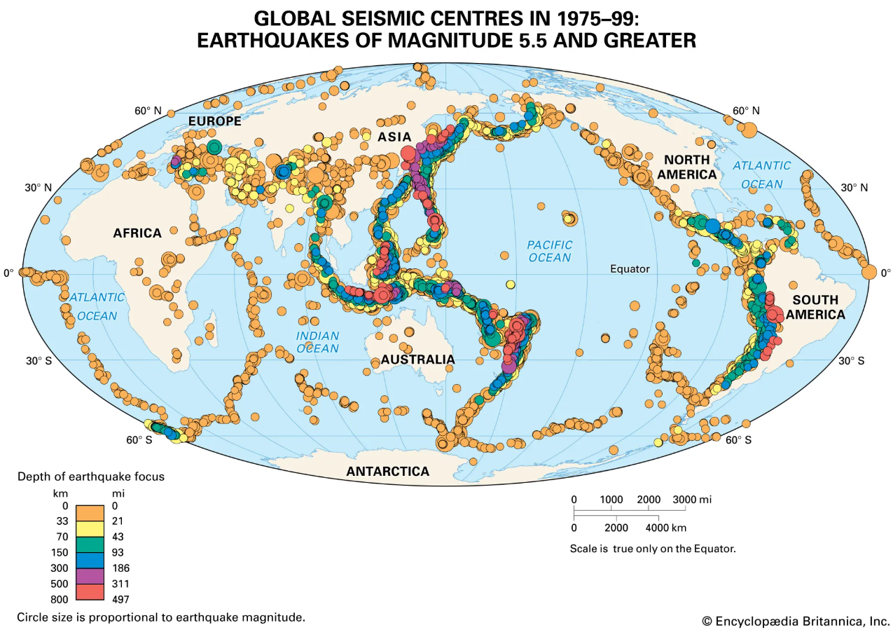
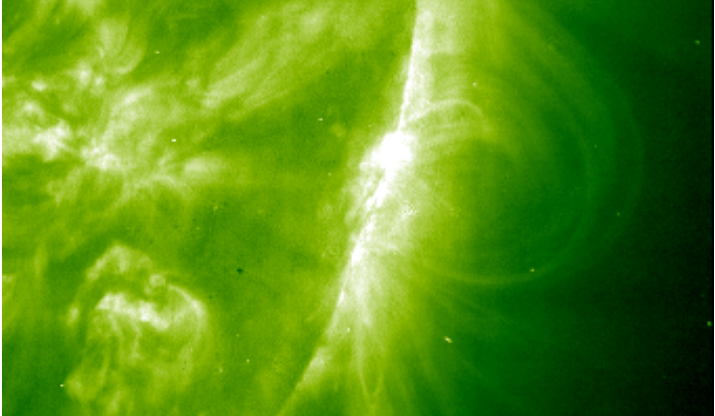
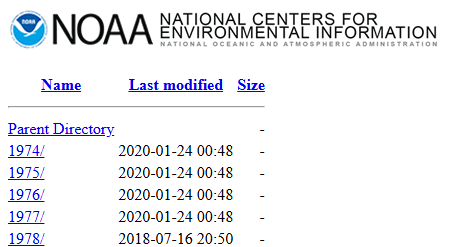

```{r setup, include=FALSE}
knitr::opts_chunk$set(echo = TRUE, warning = FALSE, message = FALSE)
```
\newpage

# Introduction
This is my final project of the Data Science: Capstone, HarvardX PH125.9x. A course in Machine Learning based on the R programming language. In this project, I will take an unbiased look into a controversial theory put forward in a YouTube video, I watched years ago: [Ben Davidson: Disaster Prediction](https://www.youtube.com/watch?v=RSfsGTAkp78) - https://www.youtube.com/watch?v=RSfsGTAkp78.

A similar claim has recently been put out there [LiveScience: Solar flares may be triggering earthquakes, controversial study claims](https://www.livescience.com/planet-earth/solar-flares-may-be-triggering-earthquakes-controversial-study-claims) - https://www.livescience.com/planet-earth/solar-flares-may-be-triggering-earthquakes-controversial-study-claims.

In this project, I will take an unbiased look at the data available to see, if there's an obvious correlation between the solar flare emissions and subsequent Earthquakes. I have no stake in the original theory (or derived theories). I have no affiliation with any of the people involved in either. Nor do I have any personal and/or monetary interest in proving the theory correct. I'm just a curious person by nature and go where the data takes me. 

Originally, I wanted to use Machine Learning to predict system failures in the build farm at work (doing approximately 13,000,000 builds/month). However, due to legal reasons (and the lead time of the legal department), the log files of the systems could not be made publicly available. This project will use the same methodology as analyzing these logs: a data trend can lead to an issue with a time delay. And the techniques are approximately the same: a "window" moving over time trying to find a relation between data and result. 

I'm an Engineer and see the world as a mix of systems and data: Anything can be modeled as a system ingesting data/incluence and producing a well defined and well predicted output. The challenge is the actual model itself.

## Plan of attack
* Setup the environment
  + Install necessary libraries (if missing)
  + Include necessary libraries
* Prepare the data set for initial analysis
  + Download data set (if missing) and unpack
  + Split the data set into training set / test set
* Analyze the data set
  + Look into data structures 
  + Visualize data to understand distributions and patterns
  + Identify any patterns
* Model Development
  + Step 1: Identify solar flare "profile"
  + Step 2: Attempt to identify a "lag" of input vs output
  + Step 3: Compare any findings with actual results
* Model Testing and Verification
* Model Analysis
* Conclusion

## Tools being used
```{r, tools, layout="l-body-outset", echo=FALSE}
library(knitr)
tools_tab <- matrix(
  c("RStudio", "RStudio 2026.07.1+147 Pacific Dogwood for windows", "Main IDE for Developing and running the code",
    "Claude", "Claude for Windows, Version 1.24012.9", "Assistant for validating syntax and web search",
    "Notepad++", "Notepad++ 8.9.1", "Scratch Pad while editing R/Rmd code",
    "PowerShell", "PowerShell 7.6.3", "Various scripting"),
  ncol = 3, byrow = TRUE
)
colnames(tools_tab) <- c("Tool", "Version", "Usage")
kable(tools_tab, row.names = FALSE)
```

## Data sources
```{r, data sources, layout="l-body-outset", echo=FALSE}
library(knitr)
data_urls_tab <- matrix(
c("USGS Earthquake Catalog","https://earthquake.usgs.gov/fdsnws/event/1/",
"Geomagnetic Kp index", "https://kp.gfz.de/app/files/Kp_ap_Ap_SN_F107_since_1932.txt",
"SILSO daily sunspot number", "https://www.sidc.be/SILSO/DATA/SN_d_tot_V2.0.csv",
"NOAA solar flare event lists", "https://www.ncei.noaa.gov/products/space-weather/legacy-data/solar-flares-events"),  ncol = 2, byrow = TRUE
)
colnames(data_urls_tab) <- c("Source", "Url")
kable(data_urls_tab, row.names = FALSE)
```

## Disclaimer!!!!!!
I'm not a Geophysicist nor an Astrophysicist!!! If it turns out, that there's a correlation between the solar flares data and the earthquake data, I will not attempt to explain the actual cause of this, the mechanics behind it or attempt to come up with an actual solution to attempt to predict earthquakes. If it turns out, that I cannot find any correlation, I will not dismiss any of the work of any physicist. 

\newpage
# Short Physics Introduction
Just to have a basic understanding of what earthquakes and solar flares are, let's briefly touch upon what, these are:

## Earthquakes
Earthquakes are defined as a sudden shaking of the surface of the Earth. This can be caused by erupting volcanoes, mining, explosions and moving of the crust of the Earth (including tectonic plates). The result of these can be shaking of the ground so powerful, that it causes buildings to collapse. It can also cause tsunamis and landslides. Earthquakes are measured on the (Open) Richter Scale. This scale is logarithmic. Meaning, that a 2 is 10x more powerful as a 1. More can be read about Earthquakes at [Britannica - Eartquakes](https://www.britannica.com/science/earthquake-geology/Intensity-and-magnitude-of-earthquakes) - https://www.britannica.com/science/earthquake-geology/Intensity-and-magnitude-of-earthquakes

```{r fig-name1, echo=FALSE, out.width="50%", fig.align="center", fig.cap="Epi centers of earthquakes"}

```

## Solar Flares
Solar flares are "explosions" on the surface of the Sun sending out energy, high speed particles and light. This energy surge can overload power grids on the Earth as well as damage electronics. Predicting solar flares could be usefull in order to protect power grids. Solar eruptions are measured on a logarithmic scale and labelled A, B, C, M and X. More can be read about solar flares at [NASA- What are solar flares](https://science.nasa.gov/science-research/heliophysics/space-weather/solar-flares/what-is-a-solar-flare/) - https://science.nasa.gov/science-research/heliophysics/space-weather/solar-flares/what-is-a-solar-flare/

```{r fig-name2, echo=FALSE, out.width="50%", fig.align="center", fig.cap="Solar flare, NASA"}

```

\newpage

# Environment setup
## Environment setup
To analyse the data and perform all the analysis, I intend to perform on the data itself, some packages need to be installed: 

```{r libraries, results='hide'}
# Create a list of required packages
# here      - assisting location file system
# httr      - handling HTTP requests (GET/POST) for retrieving data 
# readr     - reading csv files
# dplyr     - working with data frames in memory
# tidyr     - generally working with structured data
# lubridate - handling times and dates
# purrr     - handling functional programming
# slider    - working with rolling window
# ggplot2   - handling plots
# car       - supporting further analysis and for testing the model
# lmtest    - checking the model and assumptions
# tinytex   - supporting the formatting of the resulting report
required_packages <- c("here", "httr", "readr", "dplyr", "tidyr", "lubridate", "purrr", "slider", 
                       "ggplot2", "car", "lmtest", "tinytex")

# Set default URLs to point to CRAN Mirror (to simplify installing packages)
if (length(getOption("repos")) == 0 || getOption("repos")["CRAN"] == "@CRAN@")
  options(repos = c(CRAN = "https://cloud.r-project.org"))

# Discover missing packages
missing_packages <- required_packages[!required_packages %in% installed.packages()[, "Package"]]

# Install any missing packages
if (length(missing_packages))
  install.packages(missing_packages)

# Load libraries hiding the output from the results
invisible(lapply(required_packages, library, character.only = TRUE))

```

## Data retrieval
The different data sources have different ways of retrieving data:
```{r, data retrieval, layout="l-body-outset", echo=FALSE}
data_urls_and_methods_tab <- matrix(
c("USGS Earthquake Catalog","https://earthquake.usgs.gov/","GET",
"Geomagnetic Kp index", "https://kp.gfz.de/", "Download",
"SILSO daily sunspot number", "https://www.sidc.be/SILSO/", "Download", 
"NOAA solar flare event lists", "https://www.ncei.noaa.gov/", "Download Recursive"),  ncol = 3, byrow = TRUE
)
colnames(data_urls_and_methods_tab) <- c("Source", "Url", "Method")
kable(data_urls_and_methods_tab, row.names = FALSE)
```

This means, that we must use different ways of getting the data based on the URL. Basically, we need 3 different functions for handling file download: 
```{r, file download function, layout="l-body-outset"}

# Force the data folder to be in location relative to this file by setting the 
# work directory to current location
dir_current_location <- here::here()
#setwd(dir_current_location)

# Create function for downloading file from url into destination
# Only download file if this is missing from the destination
download_file <- function(url, destination_file) {

# download.file() does not create missing directories itself - it just
# errors out, so the destination folder (e.g. "data/" next to this .Rmd)
# must be created first, before checking whether the file already exists.
  dir.create(dirname(destination_file), recursive = TRUE, showWarnings = FALSE)

  if (!file.exists(destination_file))
    download.file(url, destination_file, mode = "wb")
}
```

This will work for the "Geomagnetic Kp index" and "SILSO daily sunspot number", which are text files. Since, these file are rather small, we rely on the presence of them to determine whether or not to download them. 
```{r, csv downloads, layout="l-body-outset"}

# Let's download the 2 text files to a data folder
# Only download file if this is missing from the destination
geomag_kp_gfz_url <- "https://kp.gfz.de/app/files/Kp_ap_Ap_SN_F107_since_1932.txt"
geomag_kp_gfz_data_file <- "data/geomag_kp_gfz.txt"
sunspot_silso_url <- "https://www.sidc.be/SILSO/DATA/SN_d_tot_V2.0.csv"
sunspot_silso_data_file <- "data/sunspot_silso.csv"

# Download both files
download_file(geomag_kp_gfz_url,geomag_kp_gfz_data_file)
download_file(sunspot_silso_url,sunspot_silso_data_file)

```

The NOAA data is located inside a file structure as shown in the following image: 

```{r fig-name3, echo=FALSE, out.width="50%", fig.align="center", fig.cap="Solar flare, NOOA"}

```

This means, that we need to traverse this structure to download all data (.csv files). First, we make a generic function for downloading multiple files at a time. 

```{r, recursive downloads, layout="l-body-outset"}

# Create function for downloading files from url into destination folder
# Only download file if this is missing from the destination
#
# This, in the future, could be optimized to load each "root" folder and parse
# the received HTML response. But, this is outside the scope for now. 
download_files <- function(urls, destination_folder = "~/data") {

  # Get actual full path for the destination folder
  destination_folder <- path.expand(destination_folder)

  # Loop through the provided URLs 
  for (url in urls) {
    # Extract the path of the destination relative for the root destination
    # using Regular expressions
    # Visit https://www.rexegg.com/regex-quickstart.php for more information
    # about Regular Expressions
    relative_path <- sub("^https?://[^/]+/", "", url)
    destination_file <- file.path(destination_folder, relative_path)

    # Attempt to query the Url. 
    # If the status code returned is 200 => SUCCESS! The file can be downloaded.
    # Otherwise, skip the file
    ok <- tryCatch(status_code(HEAD(url)) == 200, error = function(e) FALSE)
    if (!ok) next

    # Use the previous function to download the file while creating the 
    # destination folder is missing.
    download_file(url, destination_file)
  }
}
```

The NOAA archive has (at least) two different file layouts, so building the list of candidate URLs is specific to each layout - only the downloading itself is shared. In order to ease the download of the entire file system, we use a "hit-and-miss" strategy. Attempting to download data based on a pattern and not the actual data on the server. In future optimizations, an HTML parser COULD be added to facilitate just downloading the available data. 

```{r, noaa download assistance, layout="l-body-outset"}

# Legacy GOES 1-15 archive: one CSV per year/month/satellite, e.g.
#   .../access/avg/2018/07/goes15/csv/g15_xrs_1m_20180701_20180731.csv
# Rather than guess which satellite covered a given month, every candidate
# is included and download_files_recursively() will skip the ones that  returns
# a 404 error.
goes_legacy_xrs_urls <- function(url_pattern,
                                  years = 1975:as.integer(format(Sys.Date()
                                  , "%Y")),
                                  satellites = sprintf("goes%02d", 
                                    c(15, 14, 13, 12, 11, 10, 9, 8))) {
  urls <- character(0)
  for (year in years) {
    for (month in 1:12) {
      month_str <- sprintf("%02d", month)
      month_start <- as.Date(sprintf("%d-%s-01", year, month_str))
      if (month_start > Sys.Date()) next
      first_day <- format(month_start, "%Y%m%d")
      last_day <- format(month_start %m+% months(1) - days(1), "%Y%m%d")

      for (sat in satellites) {
        g <- sub("goes", "g", sat)
        urls <- c(urls, sprintf(url_pattern, year, month_str, sat, g, 
                                first_day, last_day))
      }
    }
  }
  urls
}

# GOES-R (16/18) science-quality archive: one NetCDF file per satellite/year, e.g.
#   .../goes16/l2/data/xrsf-l2-avg1m_science/sci_xrsf-l2-avg1m_g16_y2018_v2-2-1.nc
goes_r_xrs_urls <- function(url_pattern,
                             years = 2017:as.integer(format(Sys.Date(), "%Y")),
                             satellites = c("goes16", "goes18")) {
  urls <- character(0)
  for (sat_dir in satellites) {
    satellite <- sub("goes", "g", sat_dir)
    for (year in years) {
      urls <- c(urls, sprintf(url_pattern, sat_dir, satellite, year))
    }
  }
  urls
}
```

This will work for the "NOAA solar flare event lists", across both the legacy CSV archive and the GOES-R NetCDF archive. Be advised, that the data is downloaded to "data" folder below the data root. This is in order to keep the root folder clean. This data set is about 1.3GB, so we'll add a file for determining whether or not to download the actual data. In order to run the data download again (takes about 1 hr), delete the "noaa.lock" file in the data folder.

```{r, noaa downloads, layout="l-body-outset" }

# Download every legacy GOES XRS 1-minute CSV file, and every GOES-R
# science-quality NetCDF file, into ~/data - preserving each archive's own
# folder structure from the server
solar_flare_noaa_legacy_xrs_url_pattern <- paste0(
  "https://www.ncei.noaa.gov/data/goes-space-environment-monitor/",
  "access/avg/%d/%s/%s/csv/%s_xrs_1m_%s_%s.csv")
noaa_goes_r_url_pattern <- paste0(
  "https://data.ngdc.noaa.gov/platforms/solar-space-observing-satellites/",
  "goes/%s/l2/data/xrsf-l2-avg1m_science/sci_xrsf-l2-avg1m_%s_y%d_v2-2-1.nc")

# "Lock file" preventing further download
lock_file <- "data/noaa.lock"

# Check for presence of lock file.
# If present, don't download data.
# If not present, download data
if (!file.exists(lock_file)){
  download_files(goes_legacy_xrs_urls(solar_flare_noaa_legacy_xrs_url_pattern), destination_folder = "data")
  download_files(goes_r_xrs_urls(noaa_goes_r_url_pattern), destination_folder = "data")
  
 # Create file to prevent download
  cat("Done", file = lock_file)
}

```

Last thing to handle is using the Query API towards the Earthquake database as described in [Earthquake API - ](https://earthquake.usgs.gov/fdsnws/event/1/) https://earthquake.usgs.gov/fdsnws/event/1/ .

 From versions downloads, we only have data from 1995 until 2020, so we start by limiting our scope to 1995-2020. And since earthquakes below 2.0 will not be felt, we limit the minimum size to 2.5. 
 
 The API caps the queries in chunks of 20,000 rows, so we need a loop for this. 


```{r, ugs queries, layout="l-body-outset"}

# Query the USGS Earthquake Catalog and save the response as a CSV file,
# reusing download_file() so a month already on disk is skipped.
# This logic could be optimized, so the check is performed prior to querying
# but this is outside the scope. 
#
# The API caps a single request at 20,000 rows, so the date range is
# paginated by month, with each month saved to its own file named after
# the first day of that month.
start_date = lubridate::date("1995-01-01")
end_date = Sys.Date()
# We're also not interested in earthquakes less than 2.5
min_magnitude = 2.5

# We create a function downloading data in this interval saving files in ugs_<date>.csv files
download_usgs_quakes <- function(start_date, end_date, min_magnitude = 2.5,
                                  destination_folder = "data/ugs") {

  # Create a sequence of month
  months <- seq(as.Date(start_date), as.Date(end_date), by = "month")

  # Iterate through the month and download the query result as a file
  for (month_start in months) {
    month_start <- as.Date(month_start, origin = "1970-01-01")
    month_end <- month_start %m+% months(1) - days(1)

    # Generate the URL for the Query
    url <- paste0("https://earthquake.usgs.gov/fdsnws/event/1/query?format=csv&", 
        sprintf("starttime=%s&endtime=%s&minmagnitude=%s&limit=20000",
      format(month_start, "%Y-%m-%d"), format(month_end, "%Y-%m-%d"), 
      min_magnitude)
    )

    # Generate the destination file
    destination_file <- file.path(destination_folder, sprintf("ugs_%s.csv", format(month_start, "%Y-%m-%d")))

    # Attempt download and ignore missing files/errors
    tryCatch(download_file(url, destination_file), error = function(e) NULL)
  }
}
```

This will work for the "USGS Earthquake Catalog", saving one file per month into "data/ugs". Downloading this data takes up about 164MB of space. So, again we will add a "lock" file, "ugs.lock" in the data folder. Delete this file to download again.

```{r, noaa query, layout="l-body-outset"}

# Download every month of earthquakes (magnitude >= 2.5) into data/ugs
usgs_start_date <- "1975-01-01"
usgs_end_date <- Sys.Date()

# "Lock file" preventing further download
lock_file <- "data/ugs.lock"

# Check for presence of lock file.
# If present, don't download data.
# If not present, download data
if (!file.exists(lock_file)){
  # Run the actual download
  download_usgs_quakes(usgs_start_date, usgs_end_date)
  
  # Create file to prevent download
  cat("Done", file = lock_file)
}
```


# Data Analysis
Having downloaded all files (approximately 1.88GB), let's start looking into the various files. 

## geomag_kp_gfz.txt
This file holds data dating back to January 1st 1932 measuring sunspots and geomagnetic information. It is a text file with comments identified by #. An extract of this is (modified to fix page): 

```text
# The parameters in each line are:
#YYY MM DD  days  days_m  Bsr dB    Kp1    Kp2    Kp3    Kp4    Kp5    Kp6    Kp7    
Kp8  ap1  ap2  ap3  ap4  ap5  ap6  ap7  ap8    Ap  SN F10.7obs F10.7adj D
1932 01 01     0     0.5 1352 10  3.333  2.667  2.333  2.667  3.333  2.667  3.333  
3.333   18   12    9   12   18   12   18   18    15  22     -1.0     -1.0 2
```
From this, we see, that there are 28 columns in the row. Taking inspiration from the header of the file itself, it seems, that we can limit in information, we need: Kp and ap are three-hourly values. However, the Ap is the mean value of the planetary amplitude (Kp are derived from ap). SN is the "International Solar Spot Number". F10.7x are the 10.7 cm Solar Flux. So, we will limit the data to date (year/month/day), Ap (mean), SN and F10.7adj.

Processing the file requires basically 3 steps: 

* Reading the raw file
* Removing the comments
* Parsing each data line into a table while filtering


```{r data-parsing-geomag_kp, cache=TRUE, results='asis'}
# Read raw data lines from file
geomag_kp_raw <- readLines(geomag_kp_gfz_data_file)
# Filter out the lines starting with '#'
geomag_kp_raw <- geomag_kp_raw[!startsWith(geomag_kp_raw, "#")]

# 28 columns confirmed against the file's own header/format string:
# "YYY MM DD days days_m Bsr dB Kp1..Kp8 ap1..ap8 Ap SN F10.7obs F10.7adj D"
geomag_data <- read_table(
  # Input data from filtered lines
  I(geomag_kp_raw),
  # Setup column names
  col_names = c(
    "year", "month", "day", "days", "days_m", "bsr", "dB",
    paste0("Kp", 1:8), paste0("ap", 1:8),
    "Ap", "SN", "F107obs", "F107adj", "definitive"
  ),
  col_types = cols(.default = "d")
) %>%
  # Remove all pre 1970 data - we only have data from 1975 elsewhere. 
  filter(year >= 1970) %>%
  # Only use subset of columns
  select(year, month, day, Ap, SN, F10.7Adj = F107adj)

# Display as a formatted table
knitr::kable(
  head(geomag_data),
  caption = "Geomagnetic data"
)

cat(format(nrow(geomag_data), big.mark = ","), " rows of Geomagnetic data\n")

```

Please note, that instead of using the 1975 (which is the limit from other data sources used), we use the 1970: The Earth is a very large system, so the time between an external influence to a reaction might be counted in years. We will leave the data in the geomag_data table for now, and move on to the sunspot_silo.

## sunspot_silso.csv
The sunspot_silso file is a basic comma separated file without any headers: 
```text
1818;01;01;1818.001;  -1; -1.0;   0;1
```
However, when you visit [Info](https://www.sidc.be/SILSO/infosndtot) - https://www.sidc.be/SILSO/infosndtot, we'll get the description of the file: 
```text
-------------------------------------------------------------------------------
CSV
-------------------------------------------------------------------------------
Filename: SN_d_tot_V2.0.csv
Format: Comma Separated values (adapted for import in spreadsheets)
The separator is the semicolon ';'.

Contents:
Column 1-3: Gregorian calendar date
- Year
- Month
- Day
Column 4: Date in fraction of year.
Column 5: Daily total sunspot number. A value of -1 indicates that no number is available for 
          that day (missing value).
Column 6: Daily standard deviation of the input sunspot numbers from individual 
          stations.
Column 7: Number of observations used to compute the daily value.
Column 8: Definitive/provisional indicator. '1' indicates that the value is definitive. '0' 
          indicates that the value is still provisional.
```

Looking at this info, we start by seeing, that they use the Gregorian calender (introduced by Pope Gregory XIII in 1582), which is good, because that's the most used calendar in the world. No conversion is necessary. Based on this info, we can see, that we need year, month, day and total number of sunspots filtering out missing numbers and provisional numbers. 

```{r data-parsing-sunspot, cache=TRUE, results='asis'}
# Read raw data lines from file
sunspots_raw <- readLines(sunspot_silso_data_file)

# 8 columns confirmed against the file's info file. 
# Data is delimited by ;
sunspots_data <- read_delim(
  # Input data from the rawlines
  I(sunspots_raw),
  # Delimiter is ;
  delim = ";",
  # Setup column names
  col_names = c(
    "year", "month", "day", "dateFraction", "total", "stdDev", "noOfStations", 
    "definitive"),
  col_types = cols(.default = "d"),
  # Some of the columns are padded with whitespaces, so these need to be removed
  trim_ws = TRUE
) %>%
  # Remove all pre 1970 data - we only have data from 1975 elsewhere. 
  filter(year >= 1970 & definitive > 0) %>%
  select (year, month, day, total)

# Display as a formatted table
knitr::kable(
  head(sunspots_data),
  caption = "Sunspot data"
)

cat(format(nrow(sunspots_data), big.mark = ","), " rows of Sunspot data\n")

```

Again, please note, that instead of using the 1975 (which is the limit from other data sources used), we use the 1970: The Earth is a very large system, so the time between an external influence to a reaction might be counted in years.